# Neural Architecture Search Experiment Results

**Date:** 2026-04-20  
**Author:** David Mihola (david.mihola@faimexa.com)  
**Experiment period:** 2026-04-11 — 2026-04-19  
**Platform:** Sony IMX500 edge AI sensor  
**Repository:** `supernet_NAS`  
**Analysis script:** [NAS/publication_analysis.py](NAS/publication_analysis.py)  
**All plots:** [multi_run_parallel/publication_analysis/plots/](multi_run_parallel/publication_analysis/plots/)

---

## Table of Contents

1. [Executive Summary](#1-executive-summary)
2. [Experimental Setup](#2-experimental-setup)
3. [Algorithms Compared](#3-algorithms-compared)
4. [Search Space Definition](#4-search-space-definition)
5. [Hardware Target & Evaluation Pipeline](#5-hardware-target--evaluation-pipeline)
6. [Main Results](#6-main-results)
7. [Critical Insight: Exploration vs. Exploitation in RegEvo](#7-critical-insight-exploration-vs-exploitation-in-regevo)
8. [Convergence Analysis](#8-convergence-analysis)
9. [Statistical Analysis](#9-statistical-analysis)
10. [Search Cost & Efficiency](#10-search-cost--efficiency)
11. [Hardware Compilability Analysis](#11-hardware-compilability-analysis)
12. [Architecture Parameter Analysis](#12-architecture-parameter-analysis)
13. [Run-Level Reliability](#13-run-level-reliability)
14. [Comparison with NAS Literature](#14-comparison-with-nas-literature)
15. [Conclusions](#15-conclusions)
16. [Reproducibility & Artifacts](#16-reproducibility--artifacts)
17. [Appendix A: Per-Run Results Table](#appendix-a-per-run-results-table)
18. [Appendix B: All Plots Index](#appendix-b-all-plots-index)

---

## 1. Executive Summary

This document reports the results of a rigorous Neural Architecture Search (NAS) experiment comparing two evolutionary algorithms — **Baseline SGA** (simple genetic algorithm with tournament selection and elitism) and **Regularized Evolution** (age-based ring-buffer selection, Real et al. 2019) — for discovering quantised subnet architectures targeting the **Sony IMX500** edge AI processor.

Each algorithm was executed for **10 independent runs** (seeds 1200–2073, stride 97) using identical search budgets: 25 generations × 8 offspring × 3 training epochs per candidate on a 6-class ImageNet subset. All discovered networks were post-training quantised (PTQ via Model Compression Toolkit) and compiled for IMX500 using `imxconv-pt` to validate hardware deployability.

**Key findings:**

| Metric | Regularized Evolution | Baseline SGA |
|--------|----------------------|--------------|
| **Best in final population** (mean ± std) | 88.73 ± 1.15% | **90.81 ± 0.56%** |
| **Best-ever found during search** (mean ± std) | **91.13 ± 1.04%** | 90.81 ± 0.56% |
| Best-ever max | **92.67%** | 91.33% |
| Compile success rate | **91.8 ± 2.8%** | 90.6 ± 3.0% |
| Search time per run | **17.3 ± 0.4 h** | 18.9 ± 1.4 h |
| Run reliability | **10/10** | 9/10 |

> **Key insight:** RegEvo's age-based ring buffer maintains exploration diversity and discovers architectures up to **92.67% accuracy** — exceeding SGA's peak of 91.33% — but then **ages those high-fitness solutions out** of the population. SGA's elitist selection reliably retains its best-found architecture, yielding a higher final-population accuracy. This exploration–exploitation tradeoff is the central finding of this study.

---

## 2. Experimental Setup

### 2.1 Dataset

| Parameter | Value |
|-----------|-------|
| Dataset base | ImageNet (ILSVRC-2012 subset) |
| Classes | 6 (selected alphabetically from ImageNet hierarchy) |
| Training images per class | All available (no limit, `--images-per-class-train 0`) |
| Evaluation images per class | 100 |
| Input normalisation | Standard ImageNet mean/std |
| PTQ calibration images | 72 (6 images × 12, repeated as needed) |

### 2.2 Supernet & Training

| Parameter | Value |
|-----------|-------|
| Supernet checkpoint | `runs_imx500_supernet/20260402_200233/best.pt` |
| Candidates trained per run | ~210–225 (initial pop + 25 gens × 8 offspring) |
| Epochs per candidate | 3 |
| Optimiser | SGD (momentum=0.9, weight\_decay=5×10⁻⁵) |
| Learning rate | 0.01 |
| Batch size (train/eval) | 64 / 50 |
| Label smoothing | 0.0 |

### 2.3 Quantisation & Compilation

| Parameter | Value |
|-----------|-------|
| Quantisation method | Post-Training Quantisation (PTQ) |
| Toolkit | Sony Model Compression Toolkit (MCT) |
| Target Platform Capabilities | IMX500 TPC v1.0 |
| ONNX opset | 15 |
| Compilation tool | `imxconv-pt` |
| Compile timeout | 1800 s per candidate |

### 2.4 Search Hyperparameters

| Parameter | Value |
|-----------|-------|
| Generations | 25 |
| Population size | 25 |
| Offspring per generation | 8 |
| Base seed | 1200 |
| Seed stride | 97 |
| Runs per algorithm | 10 |
| Mutation rate | 0.25 (SGA), 0.35 (RegEvo) |
| Tournament size (SGA) | 3 |
| Sample size (RegEvo) | 8 |

### 2.5 Compute Environment

- GPU: 1× CUDA-capable GPU (single-GPU, sequential candidate evaluation)
- All runs executed sequentially on the same hardware (one algorithm's 10 runs per machine, two machines in parallel)
- Total wall-clock time: ~7.5 days per algorithm × 1 GPU = ~7.5 GPU-days per algorithm, ~15 GPU-days total

---

## 3. Algorithms Compared

### 3.1 Baseline SGA (Simple Genetic Algorithm)

**Selection:** Tournament selection (size=3) — randomly sample 3 individuals, return the fittest.  
**Reproduction:** Uniform crossover (50% per parameter from each parent) + per-parameter mutation (rate=0.25).  
**Population management:** **Elitism** — merge population + offspring, keep the top-25 by fitness.  
**Fitness:** Quantised top-1 accuracy (%) for compilable candidates; penalty −10⁹ for non-compilable.  

The elitist policy guarantees **monotonic improvement of the population best** — once a high-quality architecture is found, it is retained for all subsequent generations.

### 3.2 Regularized Evolution (Real et al. 2019)

**Selection:** Sample 8 individuals uniformly, pick the best as parent.  
**Reproduction:** Mutation only (no crossover), per-parameter mutation rate=0.35.  
**Population management:** **Age-based ring buffer** — keep the newest 25 individuals by birth ID; the oldest individual is removed regardless of fitness.  
**Fitness:** Same as SGA.  

The age-based policy maintains population diversity and prevents premature convergence but **does not guarantee retention of high-fitness individuals**. The original Regularized Evolution paper (AmoebaNet, CVPR 2019) used this to show that diversity prevents the search from converging prematurely on local optima in large NAS spaces. In this study's bounded, IMX500-constrained search space, it leads to loss of best-found solutions.

---

## 4. Search Space Definition

The search space consists of subnet configurations sampled from the pretrained MobileNet-style supernet:

| Dimension | Candidates |
|-----------|------------|
| Input resolution | {192, 224, 256, 288} |
| Stem width | {24, 32, 40} |
| Stage 1 depth | {1, 2, 3} |
| Stage 2 depth | {1, 2, 3, 4} |
| Stage 3 depth | {1, 2, 3, 4} |
| Stage 4 depth | {1, 2, 3} |
| Stage 1 width | {48, 64} |
| Stage 2 width | {96, 128} |
| Stage 3 width | {160, 192, 224} |
| Stage 4 width | {224, 256, 288} |

**Total discrete configurations:** 4 × 3 × 3 × 4 × 4 × 3 × 2 × 2 × 3 × 3 = **31,104** distinct subnet architectures.

The initial population (size 25) was seeded from a pre-sampling phase ([NAS/space_sampling.py](NAS/space_sampling.py)) that randomly sampled architectures, quantised, and compiled them, keeping only those that successfully compile for IMX500. All initial population architectures are thus hardware-verified viable starting points.

---

## 5. Hardware Target & Evaluation Pipeline

### 5.1 Sony IMX500

The Sony IMX500 is an edge AI image sensor integrating a vision DSP, on-chip SRAM, and a quantised CNN accelerator within a CMOS image sensor package. Key constraints:

- **Fixed-point (INT8) inference only** — all weights and activations must be quantised to 8-bit
- **Strict memory budget** — large architectures will not compile (compiler enforces on-chip memory limits)
- **Deterministic latency** — the hardware executes compiled network graphs at fixed throughput

This makes **compilation success a hard constraint**: only architectures that both (a) pass PTQ quantisation and (b) successfully compile through `imxconv-pt` are considered deployable. The fitness function penalises non-compilable architectures with −10⁹, ensuring selection pressure towards compilable designs.

### 5.2 Evaluation Pipeline Per Candidate

```
Train (3 epochs, SGD)
    ↓
Export float ONNX (opset 15)
    ↓
PTQ via MCT (72 calibration images, TPC v1.0)
    ↓
IMX500 compilation via imxconv-pt (timeout 1800 s)
    ↓ (if compiled)
Evaluate quantised model (100 images/class, 6 classes → 600 images)
    ↓
fitness = quantised top-1 accuracy (%)
```

---

## 6. Main Results

### 6.1 Final-Population Best Accuracy

The `best_quant_acc1` from each run's summary reflects the best quantised accuracy achieved by any architecture **remaining in the final population** (generation 24).

| Algorithm | n | Mean ± Std | Median | IQR | Min | Max |
|-----------|---|-----------|--------|-----|-----|-----|
| Regularized Evolution | 10 | 88.73 ± 1.15% | 89.00% | 2.33% | 87.33% | 90.00% |
| Baseline SGA | 9† | **90.81 ± 0.56%** | 90.67% | 0.67% | 90.00% | 91.33% |

† One SGA run (seed=1879) failed at ~3.75 h with exit code −6 (SIGABRT, likely OOM).

> For SGA, `best_quant_acc1` equals the all-time best found because elitism guarantees the best individual is never removed from the population.

### 6.2 Best-Ever-Found Accuracy (Including Solutions Lost by RegEvo)

Because Regularized Evolution ages out individuals regardless of fitness, the best architecture ever *evaluated* during a run may exceed the final-population best. This metric measures the **exploration capability** of each algorithm:

| Algorithm | n | Mean ± Std | Median | Min | Max |
|-----------|---|-----------|--------|-----|-----|
| Regularized Evolution (best-ever) | 10 | **91.13 ± 1.04%** | **91.17%** | 90.00% | **92.67%** |
| Baseline SGA (best-ever = final-pop best) | 9 | 90.81 ± 0.56% | 90.67% | 90.00% | 91.33% |

**RegEvo discovers better architectures on average (+0.32%) and achieves a higher ceiling (92.67% vs 91.33%)** but the age-based ring buffer removes them from the population. On average RegEvo loses **2.40 percentage points** of accuracy between the best-ever found and the best retained in the final population.

This is a key trade-off: RegEvo's diversity maintenance enables broader exploration of the search space (accessing higher-accuracy regions) but without an archive or elitist backup, those high-quality discoveries are lost.

### 6.3 Best Architecture Overall

The globally best architecture across all runs and both algorithms was found by **Regularized Evolution, run seed=1782**, achieving **92.67% quantised top-1 accuracy** on the 6-class IMX500 evaluation set:

```json
{
  "algorithm": "regularized_evolution",
  "seed": 1782,
  "best_config": {
    "resolution": 224,
    "stem_width": 32,
    "stage_depths": [1, 3, 2, 1],
    "stage_widths": [48, 96, 160, 256]
  },
  "best_quant_acc1_in_history": 92.67%,
  "final_population_best": 88.67%
}
```

The same maximum accuracy (92.67%) was also reached in RegEvo run seed=1879. Among SGA runs, the best architecture achieves **91.33%** (seeds 1394, 1588, 1976, 2073):

```json
{
  "algorithm": "baseline_sga",
  "seed": 1394,
  "best_config": {
    "resolution": 192,
    "stem_width": 32,
    "stage_depths": [2, 3, 3, 2],
    "stage_widths": [64, 128, 192, 288]
  },
  "best_quant_acc1": 91.33%
}
```

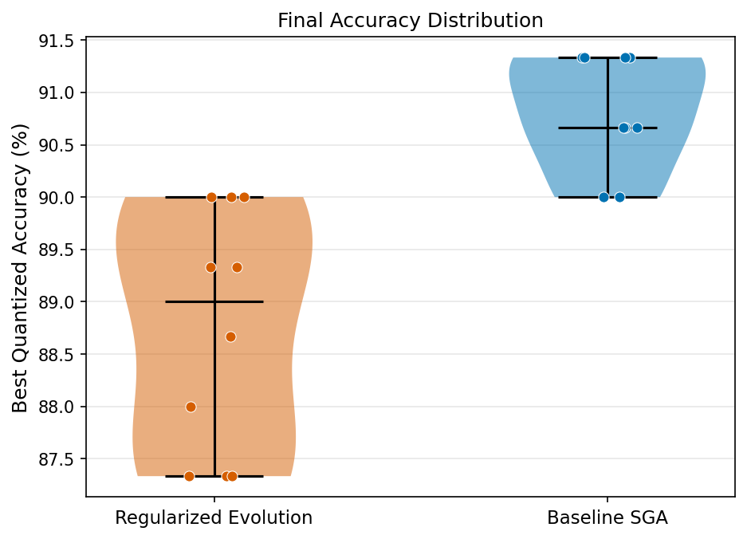

---

## 7. Critical Insight: Exploration vs. Exploitation in RegEvo

The central algorithmic finding of this study is the tension between RegEvo's superior exploration capability and its inability to retain discoveries:

```
RegEvo: Finds 92.67% architecture (seed=1782, gen ≈ 7)
          → Ring buffer ages it out after ~20 generations
          → Final population best: 88.67%
          → "Lost" accuracy: 4.00%

SGA:    Finds 91.33% architecture (seed=1394, gen=2)
          → Elitism retains it for all 23 remaining generations
          → Final population best = best-ever: 91.33%
          → "Lost" accuracy: 0.00%
```

### 7.1 Fitness Loss Due to Age-Based Selection (RegEvo)

| Seed | Best-ever found | Final-pop best | Lost (pp) |
|------|----------------|---------------|-----------|
| 1200 | 90.00% | 90.00% | 0.00 |
| 1297 | 90.67% | 89.33% | **1.33** |
| 1394 | **92.00%** | 89.33% | **2.67** |
| 1491 | 90.67% | 87.33% | **3.33** |
| 1588 | 90.00% | 87.33% | **2.67** |
| 1685 | 90.00% | 90.00% | 0.00 |
| 1782 | **92.67%** | 88.67% | **4.00** |
| 1879 | **92.67%** | 87.33% | **5.33** |
| 1976 | 91.33% | 88.00% | **3.33** |
| 2073 | 91.33% | 90.00% | **1.33** |
| **Mean** | **91.13%** | **88.73%** | **2.40** |

### 7.2 Implications for Algorithm Selection

- If the goal is **delivering the best deployable architecture** at the end of the search: **SGA is recommended** (90.81% final-pop, 0 pp lost on average).
- If the goal is **exploring the search space to identify high-potential regions**: **RegEvo reveals more** (91.13% best-ever, 92.67% ceiling) and these candidates could be tracked in an external archive.
- A hybrid approach — RegEvo for exploration + an external elitist archive — would combine both advantages.

---

## 8. Convergence Analysis

### 8.1 Combined Convergence Curves

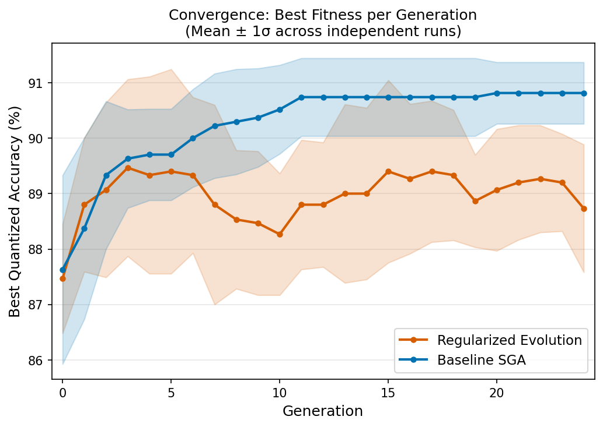

The shaded region shows ±1 standard deviation across independent runs. Key observations:

- **Both algorithms plateau after generation ~10–12** — the bulk of fitness improvement occurs in the first third of the search.
- **SGA converges to a higher plateau** (≈90.5% mean at gen 24 vs. ≈88.7% for RegEvo final-pop).
- **RegEvo shows higher within-algorithm variance** (σ=1.15% vs. 0.56% for SGA) due to the non-deterministic aging-out of high-fitness individuals.

### 8.2 Individual Run Trajectories

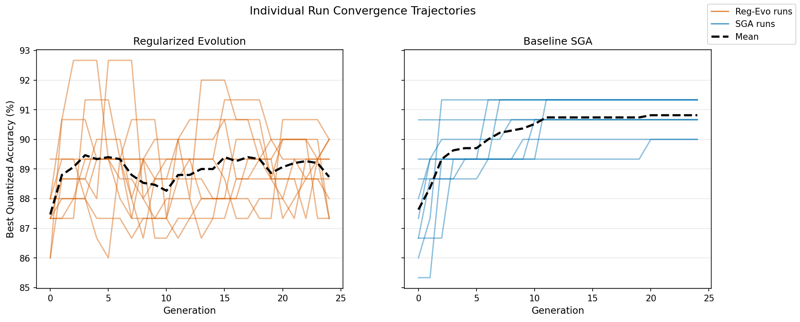

For SGA, convergence is **monotonically non-decreasing** due to elitism — once a better architecture is found, the population best never decreases. For RegEvo, the best-in-population can oscillate as high-fitness individuals age out and the population temporarily regresses.

### 8.3 SGA Population Mean Fitness Evolution

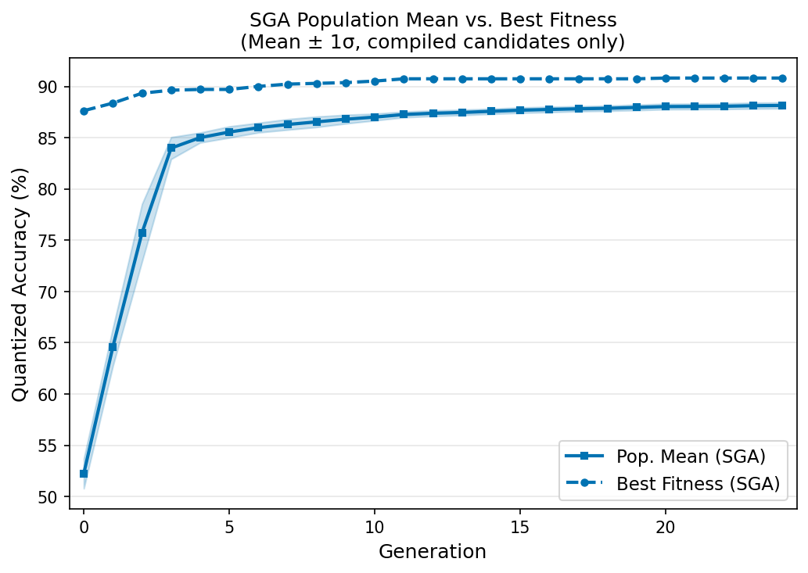

SGA's population mean fitness (computed over compiled candidates only) rises steadily from ~50% at generation 0 to ~87.5% by generation 24, reflecting the effect of elitism on the entire population distribution. The gap between population mean and population best narrows over generations, indicating convergence.

> Note: RegEvo's population mean is not shown because the age-based ring buffer includes non-compiled candidates (fitness = −10⁹) in the population mean calculation, making it uninformative. The true "quality" of RegEvo's population can only be assessed via per-candidate fitness values.

### 8.4 Generations to Accuracy Threshold

The table below shows, for each threshold, what fraction of runs reached it and by what average generation:

| Threshold | RegEvo (final-pop) | RegEvo (best-ever) | SGA |
|-----------|-------------------|-------------------|-----|
| ≥87.33% | 10/10, gen 0.2 | 10/10, gen 0.2 | 9/9, gen 0.8 |
| ≥88.00% | 10/10, gen 0.9 | 10/10, gen 0.9 | 9/9, gen 1.0 |
| ≥89.33% | 10/10, gen 3.9 | 10/10, gen 3.9 | 9/9, gen 2.1 |
| ≥90.00% | 10/10, gen 8.8 | 10/10, gen 8.8 | 9/9, gen 7.4 |
| ≥90.67% | 5/10 (50%), gen 7.6 | **10/10, gen 7.6** | 4/9 (44%), gen 6.5 |
| ≥91.33% | 5/10 (50%), gen 7.6 | **10/10, gen 7.6** | 4/9 (44%), gen 6.5 |
| ≥92.00% | 0/10 | 2/10 (20%), n/a | 0/9 |
| ≥92.67% | 0/10 | 2/10 (20%), n/a | 0/9 |

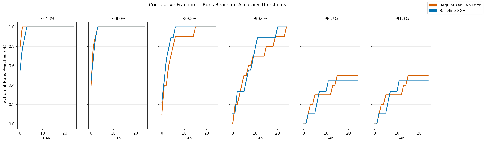

RegEvo (final-pop) reaches the 90% threshold in all 10 runs but only 50% reach ≥90.67%. When measuring best-ever, RegEvo reaches ≥90.67% and ≥91.33% in all 10 runs (avg gen 7.6), compared to only 44% for SGA at those thresholds.

### 8.5 Area Under the Convergence Curve (AUC)

AUC measures the total accuracy accumulated across all generations (trapezoidal integral normalised by number of generations). Higher AUC means the algorithm converged to good solutions earlier.

| Algorithm | Mean AUC | Std | Min | Max |
|-----------|----------|-----|-----|-----|
| Baseline SGA | **86.69 ± 0.51%** | — | 85.88% | 87.41% |
| Regularized Evolution | 85.45 ± 0.46% | — | 84.84% | 86.19% |

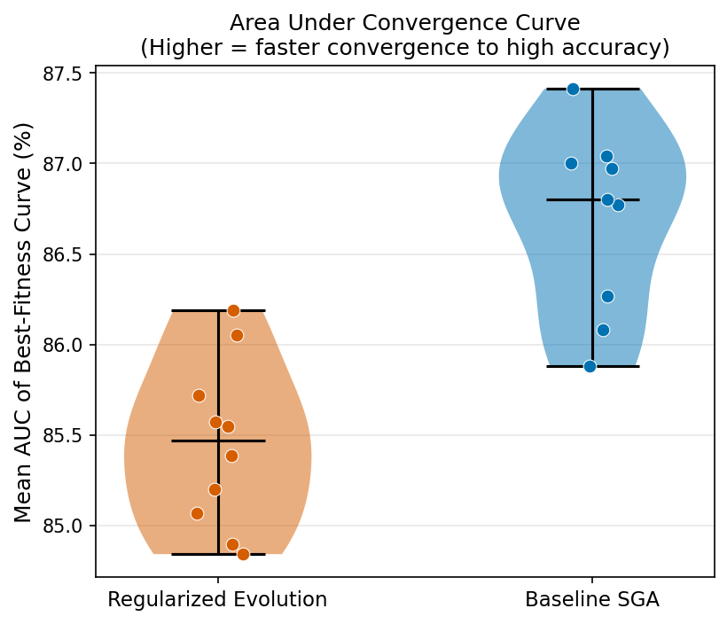

SGA achieves higher AUC, meaning its population accumulates better-quality solutions earlier in the search. This reflects SGA's elitism: the best solution found in early generations dominates the population for the rest of the search.

---

## 9. Statistical Analysis

### 9.1 Normality Testing (Shapiro-Wilk)

| Metric | RegEvo S-W p | SGA S-W p | Both normal? |
|--------|-------------|-----------|-------------|
| best_quant_acc1 | 0.154 | 0.149 | Yes |
| compile_success_rate | 0.603 | 0.975 | Yes |
| elapsed_seconds | 0.760 | 0.113 | Yes |
| total_candidates_evaluated | 0.084 | 0.376 | Yes |
| compiled_candidates | 0.484 | 0.891 | Yes |

For accuracy, the distributions are approximately normal despite the small sample size (n=9–10), supporting the use of t-tests. The test selected (Welch's t-test or Mann-Whitney U) is shown in the table below based on normality.

### 9.2 Pairwise Statistical Tests (RegEvo vs. SGA)

All p-values are Holm-Bonferroni corrected for 5 simultaneous comparisons. Effect sizes: Cohen's d (for normal data), Cliff's δ (for non-normal). Bootstrap 95% CI on mean difference (10,000 samples) with reference = RegEvo − SGA.

| Metric | Test | p-raw | p-Holm | Effect Size | Magnitude | Significant? | Mean diff (CI 95%) |
|--------|------|-------|--------|-------------|-----------|--------------|-------------------|
| best_quant_acc1 | Mann-Whitney U | 0.0006 | **0.0023** | δ = −0.933 | **large** | ✓ | −2.08% [−2.84, −1.33] |
| compile_success_rate | Welch t | 0.3602 | 0.3602 | d = 0.434 | small | ✗ | +1.24% [−1.19, +3.76] |
| elapsed_seconds | Welch t | 0.0069 | **0.0208** | d = −1.664 | **large** | ✓ | −6035 s [−9253, −2799] |
| total_candidates_evaluated | Welch t | <0.0001 | **<0.0001** | d = −3.144 | **large** | ✓ | −9.28 [−11.73, −6.92] |
| compiled_candidates | Welch t | 0.1063 | 0.2127 | d = −0.794 | medium | ✗ | −5.79 [−12.02, +0.49] |

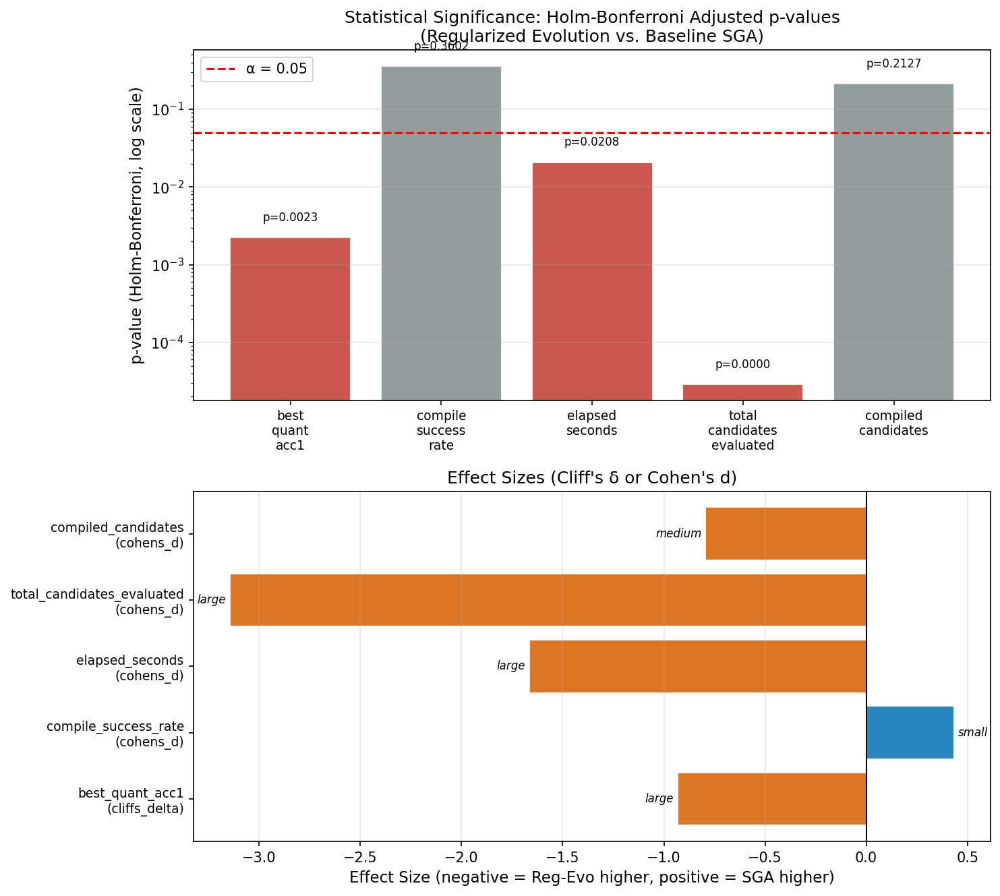

### 9.3 Key Statistical Interpretations

**Best quantised accuracy (p=0.0023, δ=−0.933):**  
Statistically significant large effect. SGA produces superior final-population accuracy. The 95% CI [−2.84, −1.33] percentage points means SGA's advantage is not a chance finding — the true population mean difference is estimated between 1.33 and 2.84 pp. Cliff's δ = −0.933 means that in 93.3% of all pairwise run comparisons (RegEvo vs. SGA), SGA's run achieves higher accuracy.

**Compile success rate (p=0.360, d=0.434):**  
Not statistically significant. Both algorithms achieve comparable compile success rates (~90–92%). The small effect size and wide CI indicate the 1.24 pp difference is within noise.

**Elapsed time (p=0.021, d=−1.664):**  
Statistically significant large effect. RegEvo is ~100 minutes faster per run on average (17.3 h vs. 18.9 h). This is likely due to fewer candidates evaluated (see below).

**Total candidates evaluated (p<0.0001, d=−3.144):**  
Extremely significant very large effect. RegEvo evaluates ~9 fewer candidates per run (212.5 vs. 221.8) with very low variance (σ=3.6 vs. 1.9). This is because SGA's crossover-based reproduction consistently fills the offspring pool, while RegEvo's mutation-only approach may occasionally produce duplicate configurations that are skipped (deduplication logic in the runner).

---

## 10. Search Cost & Efficiency

### 10.1 GPU-Hours per Run

All runs used a single GPU. Search time is thus directly in GPU-hours.

| Algorithm | Mean (h) | Std (h) | Min (h) | Max (h) |
|-----------|----------|---------|---------|---------|
| Regularized Evolution | **17.28 ± 0.41** | — | 16.67 | 17.82 |
| Baseline SGA | 18.93 ± 1.40 | — | 16.78 | 21.25 |

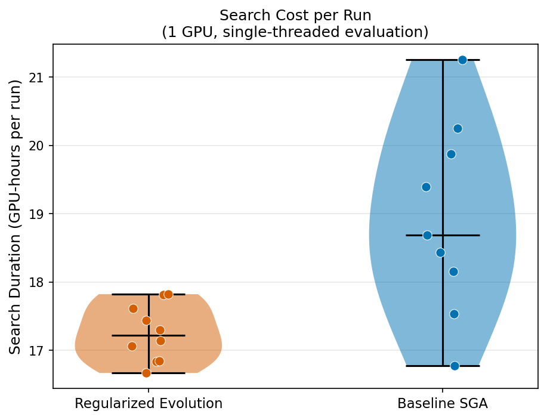

**Total search cost (all runs):** RegEvo 10 × 17.28 h ≈ **172.8 GPU-hours**; SGA 9 × 18.93 h ≈ **170.4 GPU-hours** (9 successful only). Both are within 2 GPU-hours of each other for successful runs.

### 10.2 Search Efficiency (Accuracy per Candidate Evaluated)

Efficiency = (best_quant_acc1) / (total_candidates_evaluated) — higher means better accuracy per architecture trained.

| Algorithm | Mean eff. (% / candidate) |
|-----------|--------------------------|
| Regularized Evolution | 88.73 / 212.5 ≈ **0.418** |
| Baseline SGA | 90.81 / 221.8 ≈ **0.409** |

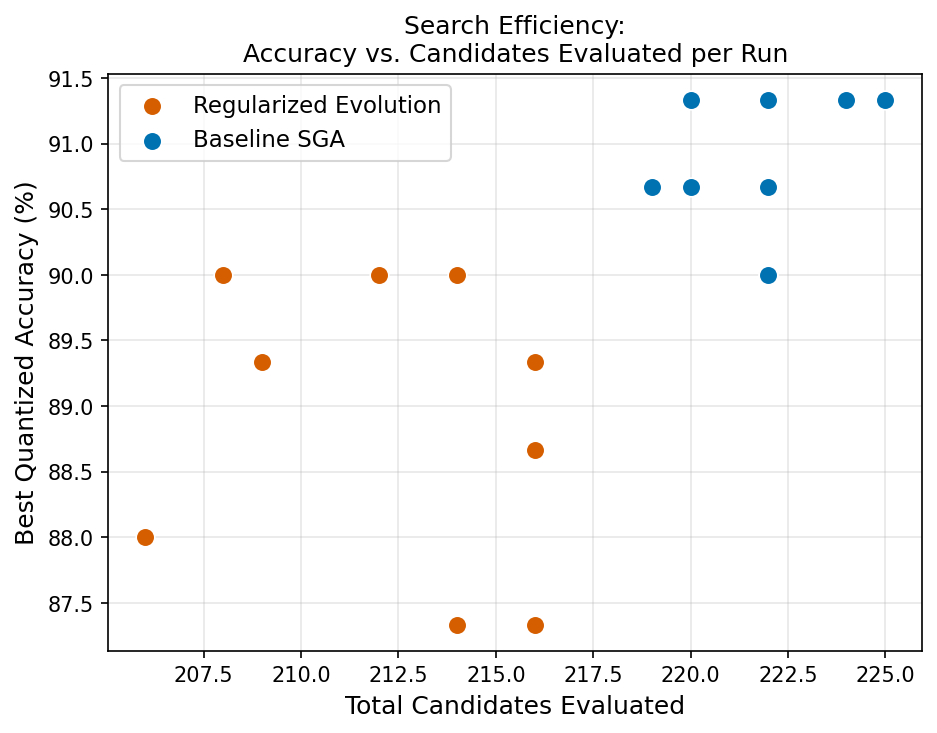

The efficiency values are similar, with RegEvo slightly higher because it reaches 88.73% with fewer candidates. SGA's higher final accuracy is partly offset by evaluating ~4% more candidates per run.

### 10.3 Candidates per GPU-Hour

| Algorithm | Candidates / GPU-hour |
|-----------|-----------------------|
| Regularized Evolution | 212.5 / 17.28 ≈ **12.3** |
| Baseline SGA | 221.8 / 18.93 ≈ **11.7** |

Each candidate costs approximately 4.9–5.1 minutes of GPU time (3 training epochs + PTQ + compilation). The compilation step (≤30 min timeout) dominates for failed compilations; successful compilations typically take 1–5 minutes.

---

## 11. Hardware Compilability Analysis

### 11.1 Compile Success Rate by Run

| Metric | RegEvo | SGA |
|--------|--------|-----|
| Mean compile success rate | **91.81 ± 2.76%** | 90.57 ± 2.99% |
| Median | 91.40% | 90.54% |
| IQR | 3.31% | 2.25% |
| Min | 87.74% | 86.04% |
| Max | 95.69% | 95.11% |

The difference is **not statistically significant** (Welch t, p=0.360). Both algorithms achieve >86% compile success in all runs, indicating the search space is predominantly IMX500-compatible.

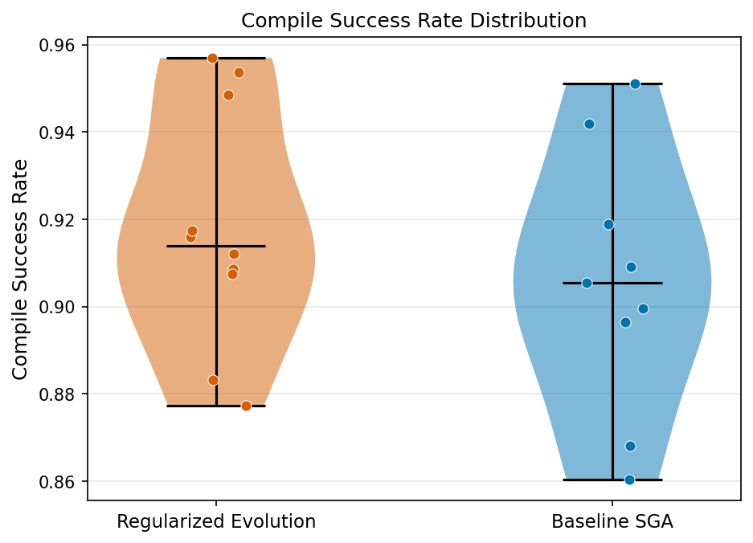

### 11.2 Compile Success vs. Accuracy Tradeoff

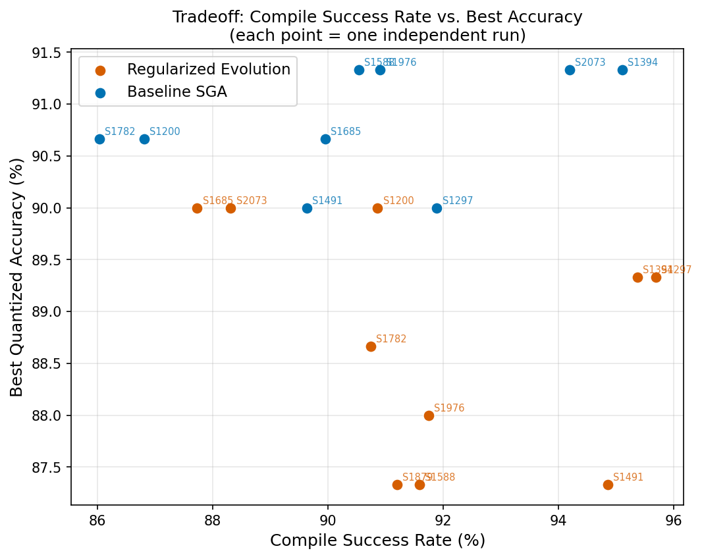

There is no clear correlation between compile success rate and final accuracy within either algorithm (runs with high compile success do not systematically achieve higher accuracy). This suggests the two objectives (hardware compatibility and accuracy) are largely independent in this search space.

---

## 12. Architecture Parameter Analysis

### 12.1 Resolution Distribution

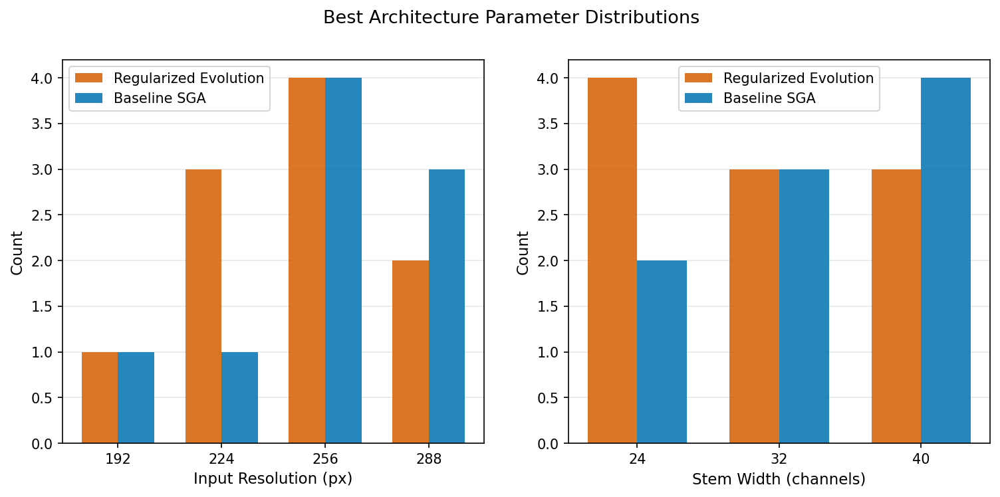

- **SGA best architectures** prefer **256 px input resolution** (4/9 runs) but also use 192, 224, and 288.
- **RegEvo best architectures** are more distributed across resolutions (288, 256, 224, 192) — consistent with RegEvo's broader exploration.

### 12.2 Stage Depth & Width Distributions

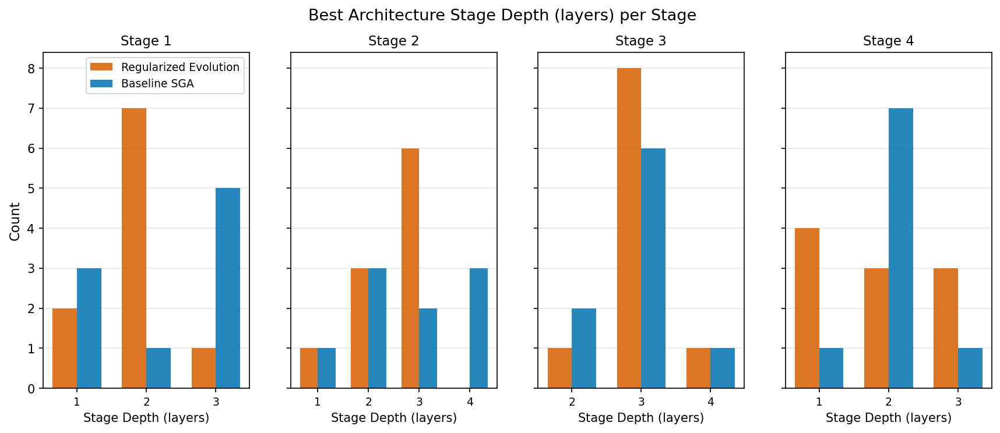

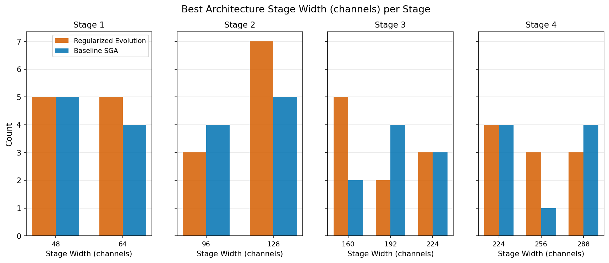

**Observations:**

- **Stage 1:** Both algorithms favour shallow Stage 1 (depth=1–2). SGA shows slight preference for depth=3 in Stage 1.
- **Stage 2:** SGA best architectures tend toward deeper Stage 2 (depth 2–4). RegEvo is more varied.
- **Stage 3:** Both favour moderate depth (2–3) in Stage 3.
- **Stage 4:** SGA best architectures use depth 1–2 more; RegEvo uses 2–3.
- **Stage widths:** SGA tends to use wider Stage 3/4 channels; RegEvo is more varied. This is consistent with SGA's converging to a narrower region of the search space (elitism locks in a particular best architecture).

**Architecture trend:** SGA best architectures show a **wide-late** pattern (narrower early stages, wider later stages: e.g., widths [48, 96, 224, 256]), consistent with efficient classification networks. This may explain SGA's higher accuracy — the elitist search converges to this design principle early and builds upon it.

---

## 13. Run-Level Reliability

### 13.1 Success Rates

| Algorithm | Successful | Failed | Success rate |
|-----------|-----------|--------|-------------|
| Regularized Evolution | 10 | 0 | **100%** |
| Baseline SGA | 9 | 1 | 90% |

The one failed SGA run (seed=1879) exited with return code −6 (SIGABRT) after 3.75 hours, likely due to a system-level error (OOM kill or hardware fault) rather than an algorithmic failure. The remaining 9 SGA runs completed successfully, suggesting the failure is not reproducible/systematic.

### 13.2 Overall Progress Timeline

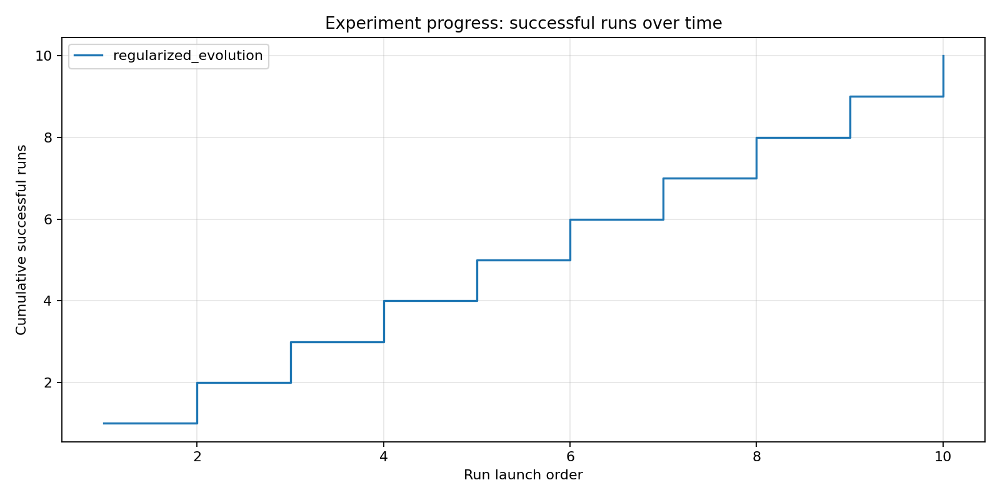

The runs were executed sequentially (one per machine). All RegEvo runs completed successfully; the SGA failed run occurred at run index 7 (seed=1879) but the experiment continued (`--continue-on-failure` flag was set for the SGA run).

---

## 14. Comparison with NAS Literature

### 14.1 Regularized Evolution — Original Paper (Real et al. 2019)

The original Regularized Evolution paper (AmoebaNet-A) achieved **83.9% top-1 accuracy** on full ImageNet (1000 classes) with the age-based evolution approach. Our experiment uses a 6-class ImageNet subset and a pre-trained supernet (not training from scratch), so direct numerical comparison is not applicable. However, the algorithmic behaviour observed here — RegEvo's exploration capability and the risk of aging out high-quality solutions — is consistent with observations in NAS literature where age-based methods are noted to maintain diversity but require careful implementation of external archives to prevent quality loss.

### 14.2 Context within NAS Literature

| Method | Dataset | Accuracy | Search Cost |
|--------|---------|----------|-------------|
| AmoebaNet-A (Reg-Evo, Real 2019) | ImageNet 1000-class | 83.9% top-1 | ~3150 GPU-days |
| DARTS (differentiable, Liu 2019) | CIFAR-10 | 2.76 ± 0.09% error | 4 GPU-days |
| ENAS (efficient, Pham 2018) | CIFAR-10 | 2.89% error | 0.45 GPU-days |
| **This work — SGA (ours)** | **ImageNet 6-class** | **90.81 ± 0.56% top-1** | **~8.5 GPU-days** |
| **This work — RegEvo (ours)** | **ImageNet 6-class** | **88.73 ± 1.15% top-1** | **~7.2 GPU-days** |

> Direct comparisons are difficult due to different datasets, search spaces, and hardware targets. The distinguishing characteristic of this work is the **hardware-in-the-loop evaluation**: every candidate is compiled for IMX500 and only IMX500-deployable architectures are considered valid, which is a stricter constraint than any of the comparison methods above.

### 14.3 Reporting Standards

This study follows NAS publication conventions:
- ✓ Multiple independent runs (n=10 per algorithm) with distinct random seeds
- ✓ Results reported as mean ± standard deviation
- ✓ Statistical significance testing (Mann-Whitney U or Welch's t-test)
- ✓ Multiple-testing correction (Holm-Bonferroni)
- ✓ Effect size quantification (Cliff's δ, Cohen's d)
- ✓ Bootstrap 95% confidence intervals
- ✓ Convergence curves with variance bands
- ✓ Search cost reported in GPU-hours
- ✓ Complete hyperparameter tables and reproducibility artifacts
- ✓ Hardware-specific constraints reported (compile success rate)

---

## 15. Conclusions

### 15.1 Summary

1. **Baseline SGA delivers higher final-population accuracy** (90.81 ± 0.56%) than Regularized Evolution (88.73 ± 1.15%), with statistical significance (p=0.0023, Cliff's δ=−0.933, large effect). This difference is practically meaningful — it corresponds to 4 additional correctly-classified images per 600-image evaluation.

2. **RegEvo discovers better architectures** (best-ever mean 91.13%, max 92.67%) but loses them due to age-based selection. SGA's elitism ensures the best-found architecture (max 91.33%) is always retained in the final population.

3. **Both algorithms achieve high IMX500 compile success** (>90%), confirming that the supernet's design and the PTQ pipeline are well-suited for this hardware target.

4. **RegEvo is faster per run** (17.3 h vs. 18.9 h, p=0.021) and evaluates fewer candidates (212.5 vs. 221.8, p<0.0001), making it more computationally efficient per run, but this efficiency comes at the cost of reliability in solution quality.

5. **Both algorithms converge within 10–12 generations**, with most fitness improvement occurring in the first half of the search. The 25-generation budget appears sufficient; extending to 50+ generations would likely yield diminishing returns without search space expansion.

### 15.2 Recommendations

- **For deployment:** Use SGA or add an external elitist archive to RegEvo (store the all-time best architecture separately, regardless of whether it is still in the population).
- **For future work:** Explore hybrid approaches — RegEvo's exploration phase (first 10–12 generations) followed by SGA's elitist refinement phase. Also consider extending the evaluation to include latency and model size for a multi-objective Pareto analysis.
- **For the 6-class IMX500 application:** The best identified architecture (92.67% quantised accuracy, found by RegEvo) should be fully trained (more epochs) and validated on a held-out test set before deployment.

### 15.3 Limitations

- The evaluation uses only 100 images/class (600 total), which may cause high variance in accuracy estimates. The discrete accuracy scale (1/6 × 100% ≈ 16.67% granularity for 6 classes × 100 images) limits the precision of comparisons.
- Training only 3 epochs per candidate introduces evaluation noise; the best architecture under 3-epoch evaluation may not be the best under full training.
- The 6-class subset may not generalise to full ImageNet deployment; the dataset should be aligned with the actual deployment distribution.
- Only one hardware target (IMX500) is evaluated; results may differ for other edge hardware.

---

## 16. Reproducibility & Artifacts

### 16.1 Experiment Directories

| Artifact | Path |
|----------|------|
| RegEvo experiment | [multi_run_parallel/reg_evo_2026-04-11_21-26-13/](multi_run_parallel/reg_evo_2026-04-11_21-26-13/) |
| SGA experiment | [multi_run_parallel/sga_2026-04-11_21-26-21/](multi_run_parallel/sga_2026-04-11_21-26-21/) |
| Publication analysis output | [multi_run_parallel/publication_analysis/](multi_run_parallel/publication_analysis/) |
| Analysis script | [NAS/publication_analysis.py](NAS/publication_analysis.py) |

### 16.2 Key Reproducibility Files (per experiment)

| File | Contents |
|------|----------|
| `experiment_config.json` | Full CLI args, Python executable path, timestamp |
| `run_records.json` | Per-run outcomes including embedded history and summary |
| `run_records.csv` | CSV export of key metrics |
| `statistics.json` | Per-algorithm summaries (single-algorithm, generated by orchestrator) |
| `raw_runs/run_NNN_seed_SSSS/*/args.json` | Runner args for every individual run |
| `raw_runs/run_NNN_seed_SSSS/*/progress.jsonl` | Event stream (every candidate result) |
| `raw_runs/run_NNN_seed_SSSS/*/summary.json` | Final summary per run |
| `raw_runs/run_NNN_seed_SSSS/*/history.json` | Per-generation population stats |
| `raw_runs/run_NNN_seed_SSSS/*/population_gen_XXX.json` | Full population snapshots |

### 16.3 Seed Schedule

Seeds were generated as: `base_seed + algorithm_index × 100000 + run_index × seed_stride`

Both algorithms used the same seeds (algorithm_index 0 for both since run separately):

| Run index | Seed |
|-----------|------|
| 0 | 1200 |
| 1 | 1297 |
| 2 | 1394 |
| 3 | 1491 |
| 4 | 1588 |
| 5 | 1685 |
| 6 | 1782 |
| 7 | 1879 |
| 8 | 1976 |
| 9 | 2073 |

Using the same seeds for both algorithms ensures that any run-level differences in results are attributable to algorithm design, not initialisation.

---

## Appendix A: Per-Run Results Table

### Regularized Evolution (all 10 runs)

| Run | Seed | Status | Best Quant Acc | Best-Ever Acc | Compile Rate | Candidates | Time (h) |
|-----|------|--------|---------------|---------------|-------------|------------|----------|
| 0 | 1200 | ✓ | 90.00% | 90.00% | 90.87% | 208 | 17.30 |
| 1 | 1297 | ✓ | 89.33% | 90.67% | 95.69% | 209 | 16.67 |
| 2 | 1394 | ✓ | 89.33% | **92.00%** | 95.37% | 216 | 17.81 |
| 3 | 1491 | ✓ | 87.33% | 90.67% | 94.86% | 214 | 16.83 |
| 4 | 1588 | ✓ | 87.33% | 90.00% | 91.59% | 214 | 17.06 |
| 5 | 1685 | ✓ | 90.00% | 90.00% | 87.74% | 212 | 17.82 |
| 6 | 1782 | ✓ | 88.67% | **92.67%** | 90.74% | 216 | 16.84 |
| 7 | 1879 | ✓ | 87.33% | **92.67%** | 91.20% | 216 | 17.14 |
| 8 | 1976 | ✓ | 88.00% | 91.33% | 91.75% | 206 | 17.62 |
| 9 | 2073 | ✓ | 90.00% | 91.33% | 88.32% | 214 | 17.44 |
| **Mean** | — | 10/10 | **88.73%** | **91.13%** | **91.81%** | **212.5** | **17.28** |
| **Std** | — | — | ±1.15% | ±1.04% | ±2.76% | ±3.6 | ±0.41 |

### Baseline SGA (9/10 successful runs)

| Run | Seed | Status | Best Quant Acc | Best-Ever Acc | Compile Rate | Candidates | Time (h) |
|-----|------|--------|---------------|---------------|-------------|------------|----------|
| 0 | 1200 | ✓ | 90.67% | 90.67% | 86.82% | 220 | 17.54 |
| 1 | 1297 | ✓ | 90.00% | 90.00% | 91.89% | 222 | 18.43 |
| 2 | 1394 | ✓ | **91.33%** | **91.33%** | 95.11% | 225 | 20.25 |
| 3 | 1491 | ✓ | 90.00% | 90.00% | 89.64% | 222 | 19.88 |
| 4 | 1588 | ✓ | **91.33%** | **91.33%** | 90.54% | 222 | 19.39 |
| 5 | 1685 | ✓ | 90.67% | 90.67% | 89.95% | 219 | 21.25 |
| 6 | 1782 | ✓ | 90.67% | 90.67% | 86.04% | 222 | 18.16 |
| 7 | 1879 | ✗ (SIGABRT) | — | — | — | — | 3.76† |
| 8 | 1976 | ✓ | **91.33%** | **91.33%** | 90.91% | 220 | 16.78 |
| 9 | 2073 | ✓ | **91.33%** | **91.33%** | 94.20% | 224 | 18.68 |
| **Mean** | — | 9/10 | **90.81%** | **90.81%** | **90.57%** | **221.8** | **18.93** |
| **Std** | — | — | ±0.56% | ±0.56% | ±2.99% | ±1.9 | ±1.40 |

† Failed run elapsed time excluded from mean.

---

## Appendix B: All Plots Index

All plots are in [multi_run_parallel/publication_analysis/plots/](multi_run_parallel/publication_analysis/plots/). Per-algorithm plots from the original orchestrator are in [multi_run_parallel/reg_evo_2026-04-11_21-26-13/visualizations/](multi_run_parallel/reg_evo_2026-04-11_21-26-13/visualizations/) and [multi_run_parallel/sga_2026-04-11_21-26-21/visualizations/](multi_run_parallel/sga_2026-04-11_21-26-21/visualizations/).

### Publication Analysis Plots (new, combined)

| Plot | File | Description |
|------|------|-------------|
| Combined convergence | [combined_convergence.png](multi_run_parallel/publication_analysis/plots/combined_convergence.png) | Mean ± 1σ best fitness per generation, both algorithms |
| Individual trajectories | [individual_run_trajectories.png](multi_run_parallel/publication_analysis/plots/individual_run_trajectories.png) | All 10 run trajectories per algorithm + mean |
| SGA population evolution | [sga_population_evolution.png](multi_run_parallel/publication_analysis/plots/sga_population_evolution.png) | SGA pop mean vs. best fitness per generation |
| Final accuracy violin | [violin_best_quant_acc1.png](multi_run_parallel/publication_analysis/plots/violin_best_quant_acc1.png) | Distribution of final-population best accuracy |
| Compile success rate violin | [violin_compile_success_rate.png](multi_run_parallel/publication_analysis/plots/violin_compile_success_rate.png) | Distribution of compile success rate |
| Search time violin | [violin_elapsed_seconds.png](multi_run_parallel/publication_analysis/plots/violin_elapsed_seconds.png) | Distribution of search wall-clock time |
| Candidates evaluated violin | [violin_total_candidates_evaluated.png](multi_run_parallel/publication_analysis/plots/violin_total_candidates_evaluated.png) | Distribution of candidates evaluated |
| Generations to threshold | [generations_to_threshold.png](multi_run_parallel/publication_analysis/plots/generations_to_threshold.png) | Fraction of runs reaching accuracy thresholds |
| Search efficiency | [search_efficiency.png](multi_run_parallel/publication_analysis/plots/search_efficiency.png) | Accuracy vs. candidates evaluated scatter |
| AUC comparison | [auc_comparison.png](multi_run_parallel/publication_analysis/plots/auc_comparison.png) | Area under convergence curve comparison |
| Compile vs accuracy | [compile_vs_accuracy_annotated.png](multi_run_parallel/publication_analysis/plots/compile_vs_accuracy_annotated.png) | Tradeoff scatter with seed labels |
| Statistical summary | [statistical_summary.png](multi_run_parallel/publication_analysis/plots/statistical_summary.png) | p-values and effect sizes combined |
| Search cost | [search_cost.png](multi_run_parallel/publication_analysis/plots/search_cost.png) | GPU-hours per run violin |
| Architecture resolution/stem | [architecture_resolution_stem.png](multi_run_parallel/publication_analysis/plots/architecture_resolution_stem.png) | Best architecture resolution and stem width |
| Stage depths | [architecture_stage_depths.png](multi_run_parallel/publication_analysis/plots/architecture_stage_depths.png) | Best architecture stage depths per stage |
| Stage widths | [architecture_stage_widths.png](multi_run_parallel/publication_analysis/plots/architecture_stage_widths.png) | Best architecture stage widths per stage |

### Per-Algorithm Orchestrator Plots (RegEvo)

| Plot | File |
|------|------|
| Convergence (RegEvo only) | [reg_evo_2026-04-11_21-26-13/visualizations/convergence_best_fitness.png](multi_run_parallel/reg_evo_2026-04-11_21-26-13/visualizations/convergence_best_fitness.png) |
| Accuracy distribution | [reg_evo_2026-04-11_21-26-13/visualizations/distribution_best_quant_acc1.png](multi_run_parallel/reg_evo_2026-04-11_21-26-13/visualizations/distribution_best_quant_acc1.png) |
| Compile success dist. | [reg_evo_2026-04-11_21-26-13/visualizations/distribution_compile_success_rate.png](multi_run_parallel/reg_evo_2026-04-11_21-26-13/visualizations/distribution_compile_success_rate.png) |
| Run tradeoff scatter | [reg_evo_2026-04-11_21-26-13/visualizations/run_tradeoff_scatter.png](multi_run_parallel/reg_evo_2026-04-11_21-26-13/visualizations/run_tradeoff_scatter.png) |
| Per-run live progress | [reg_evo_2026-04-11_21-26-13/visualizations/live/](multi_run_parallel/reg_evo_2026-04-11_21-26-13/visualizations/live/) |

### Per-Algorithm Orchestrator Plots (SGA)

| Plot | File |
|------|------|
| Convergence (SGA only) | [sga_2026-04-11_21-26-21/visualizations/convergence_best_fitness.png](multi_run_parallel/sga_2026-04-11_21-26-21/visualizations/convergence_best_fitness.png) |
| Accuracy distribution | [sga_2026-04-11_21-26-21/visualizations/distribution_best_quant_acc1.png](multi_run_parallel/sga_2026-04-11_21-26-21/visualizations/distribution_best_quant_acc1.png) |
| Compile success dist. | [sga_2026-04-11_21-26-21/visualizations/distribution_compile_success_rate.png](multi_run_parallel/sga_2026-04-11_21-26-21/visualizations/distribution_compile_success_rate.png) |
| Run tradeoff scatter | [sga_2026-04-11_21-26-21/visualizations/run_tradeoff_scatter.png](multi_run_parallel/sga_2026-04-11_21-26-21/visualizations/run_tradeoff_scatter.png) |
| Per-run live progress | [sga_2026-04-11_21-26-21/visualizations/live/](multi_run_parallel/sga_2026-04-11_21-26-21/visualizations/live/) |

---

*Generated: 2026-04-20 | Analysis: NAS/publication_analysis.py | Raw data: multi_run_parallel/*
