# Neural Architecture Search Experiment Results — CIFAR-10

**Date:** 2026-06-04  
**Author:** David Mihola (david.mihola@faimexa.com)  
**Experiment period:** 2026-05-31 — 2026-06-02  
**Platform:** Sony IMX500 edge AI sensor  
**Repository:** `supernet_NAS`  
**Analysis script:** [NAS/publication_analysis.py](NAS/publication_analysis.py)  
**All plots:** [multi_run_parallel/2026-05-31_cifar10/publication_analysis_2026-05-31/plots/](multi_run_parallel/2026-05-31_cifar10/publication_analysis_2026-05-31/plots/)

---

## Table of Contents

1. [Executive Summary](#1-executive-summary)
2. [Experimental Setup](#2-experimental-setup)
3. [Algorithms Compared](#3-algorithms-compared)
4. [Search Space Definition](#4-search-space-definition)
5. [Hardware Target & Evaluation Pipeline](#5-hardware-target--evaluation-pipeline)
6. [Main Results](#6-main-results)
7. [Critical Insight: Exploration vs. Exploitation in RegEvo](#7-critical-insight-exploration-vs-exploitation-in-regevo)
8. [Convergence Analysis](#8-convergence-analysis)
9. [Statistical Analysis](#9-statistical-analysis)
10. [Search Cost & Efficiency](#10-search-cost--efficiency)
11. [Hardware Compilability Analysis](#11-hardware-compilability-analysis)
12. [Architecture Parameter Analysis](#12-architecture-parameter-analysis)
13. [Run-Level Reliability](#13-run-level-reliability)
14. [Comparison with ImageNet Experiment & NAS Literature](#14-comparison-with-imagenet-experiment--nas-literature)
15. [Conclusions](#15-conclusions)
16. [Reproducibility & Artifacts](#16-reproducibility--artifacts)
17. [Appendix A: Per-Run Results Table](#appendix-a-per-run-results-table)
18. [Appendix B: All Plots Index](#appendix-b-all-plots-index)

---

## 1. Executive Summary

This document reports the results of a NAS experiment comparing **Baseline SGA** and **Regularized Evolution** on the **CIFAR-10** dataset, targeting the **Sony IMX500** edge AI processor. This is the second experiment in the series (see [EXPERIMENT_RESULTS_20260420.md](EXPERIMENT_RESULTS_20260420.md) for the ImageNet 6-class experiment). The primary goal of this experiment was to evaluate whether the algorithmic findings from the ImageNet experiment generalise to a different, more standard benchmark dataset with a larger number of classes.

Each algorithm was executed for **10 independent runs** (seeds 1200–2073, stride 97) using identical search budgets: 25 generations × 8 offspring × 10 training epochs per candidate on CIFAR-10 (10 classes). Training used a fold-based approach (10 folds, 10% of data per fold). All discovered networks were post-training quantised (PTQ via Model Compression Toolkit) and compiled for IMX500 using `imxconv-pt`.

**Key findings:**

| Metric | Regularized Evolution | Baseline SGA |
|--------|----------------------|--------------|
| **Best in final population** (mean ± std) | 81.88 ± 0.56% | **83.35 ± 0.49%** |
| **Best-ever found during search** (mean ± std) | **83.90 ± 0.93%** | 83.35 ± 0.49% |
| Best-ever max | **85.50%** | 84.00% |
| Compile success rate | **96.94 ± 1.27%** | 96.62 ± 1.34% |
| Search time per run | **4.81 ± 0.36 h** | 5.64 ± 0.55 h |
| Run reliability | **10/10** | **10/10** |

> **Key insight (consistent with ImageNet findings):** RegEvo's age-based ring buffer discovers architectures up to **85.50% accuracy** — exceeding SGA's peak of 84.00% — but ages those high-fitness solutions out of the population. SGA's elitism reliably retains the best found, yielding higher final-population accuracy (83.35% vs 81.88%). The exploration–exploitation tradeoff identified in the ImageNet experiment is **reproduced on CIFAR-10**, confirming it is an inherent property of the algorithms rather than a dataset-specific artifact. The accuracy gap (SGA advantage: 1.475 pp) is smaller in absolute terms than in ImageNet (2.08 pp) but the effect size is even larger (Cohen's d = 2.82 vs Cliff's δ = 0.93), reflecting tighter within-algorithm consistency on CIFAR-10.

---

## 2. Experimental Setup

### 2.1 Dataset

| Parameter | Value |
|-----------|-------|
| Dataset | CIFAR-10 |
| Classes | 10 |
| Training images per class | All available (no limit) |
| Evaluation images per class | 40 |
| Total evaluation images | 400 (10 classes × 40) |
| Input normalisation | CIFAR-10 standard mean/std |
| PTQ calibration images | 50 |
| Training strategy | Fold-based: 10 folds, 10% of data per fold |

**Note on fold-based training:** Each candidate is trained for 10 epochs, but each epoch is drawn from a different fold covering 10% of the training data. This is equivalent to approximately one full pass over the training set, distributed across 10 epochs. This design avoids overfitting to a fixed random subset while keeping per-candidate training time short (~81 seconds per candidate).

### 2.2 Supernet & Training

| Parameter | Value |
|-----------|-------|
| Supernet checkpoint | `runs_imx500_supernet/20260402_200233/best.pt` |
| Candidates trained per run | ~206–217 (initial pop + 25 gens × 8 offspring) |
| Epochs per candidate | 10 (fold-based, 10% data per fold) |
| Optimiser | SGD (momentum=0.9, weight\_decay=5×10⁻⁵) |
| Learning rate | 0.01 |
| Batch size (train/eval) | 256 / 200 |
| Label smoothing | 0.0 |

### 2.3 Quantisation & Compilation

| Parameter | Value |
|-----------|-------|
| Quantisation method | Post-Training Quantisation (PTQ) |
| Toolkit | Sony Model Compression Toolkit (MCT) |
| Target Platform Capabilities | IMX500 TPC v1.0 |
| ONNX opset | 15 |
| Compilation tool | `imxconv-pt` |
| Compile timeout | 1800 s per candidate |

### 2.4 Search Hyperparameters

| Parameter | Value |
|-----------|-------|
| Generations | 25 |
| Population size | 25 |
| Offspring per generation | 8 |
| Base seed | 1200 |
| Seed stride | 97 |
| Runs per algorithm | 10 |
| Mutation rate | 0.25 (both algorithms) |
| Tournament size (SGA) | 3 |
| Sample size (RegEvo) | 8 |

### 2.5 Compute Environment

- GPU: 1× CUDA-capable GPU (single-GPU, sequential candidate evaluation)
- All runs executed sequentially on the same hardware (one algorithm's 10 runs per machine, two machines in parallel)
- Total wall-clock time: ~2.0 GPU-days per algorithm, ~4.0 GPU-days total
- Per-candidate training time: ~81 s (RegEvo) / ~92 s (SGA) — approximately 3.6× faster than the ImageNet experiment

---

## 3. Algorithms Compared

### 3.1 Baseline SGA (Simple Genetic Algorithm)

**Selection:** Tournament selection (size=3) — randomly sample 3 individuals, return the fittest.  
**Reproduction:** Uniform crossover (50% per parameter from each parent) + per-parameter mutation (rate=0.25).  
**Population management:** **Elitism** — merge population + offspring, keep the top-25 by fitness.  
**Fitness:** Quantised top-1 accuracy (%) for compilable candidates; penalty −10⁹ for non-compilable.

The elitist policy guarantees **monotonic improvement of the population best** — once a high-quality architecture is found, it is retained for all subsequent generations.

### 3.2 Regularized Evolution (Real et al. 2019)

**Selection:** Sample 8 individuals uniformly, pick the best as parent.  
**Reproduction:** Mutation only (no crossover), per-parameter mutation rate=0.25.  
**Population management:** **Age-based ring buffer** — keep the newest 25 individuals by birth ID; the oldest individual is removed regardless of fitness.  
**Fitness:** Same as SGA.

The age-based policy maintains population diversity but **does not guarantee retention of high-fitness individuals**.

---

## 4. Search Space Definition

The search space consists of subnet configurations sampled from the pretrained MobileNet-style supernet. For CIFAR-10, the spatial resolution candidates are smaller than for ImageNet, and Stage 3 has a wider depth range:

| Dimension | Candidates |
|-----------|------------|
| Input resolution | {28, 32, 34} |
| Stem width | {24, 32, 40} |
| Stage 1 depth | {1, 2, 3} |
| Stage 2 depth | {1, 2, 3, 4} |
| Stage 3 depth | {1, 2, 3, 4, 5, 6} |
| Stage 4 depth | {1, 2, 3} |
| Stage 1 width | {48, 64} |
| Stage 2 width | {96, 128} |
| Stage 3 width | {160, 192, 224} |
| Stage 4 width | {224, 256, 288} |

**Total discrete configurations:** 3 × 3 × 3 × 4 × 6 × 3 × 2 × 2 × 3 × 3 = **69,984** distinct subnet architectures.

This is a **larger search space than the ImageNet experiment** (69,984 vs 31,104), primarily due to the extended Stage 3 depth range ({1–6} vs {1–4}). However, because CIFAR-10 spatial dimensions are much smaller than ImageNet, deeper Stage 3 configurations are more readily compilable for IMX500.

In practice, all best architectures in both algorithms use **resolution=34** — the largest CIFAR-10 resolution candidate. This is consistent with the generally observed preference for larger input resolution when accuracy is the sole objective.

The initial population (size 25) was seeded from a pre-sampling phase ([NAS/space_sampling.py](NAS/space_sampling.py)) that randomly sampled architectures, quantised, and compiled them for IMX500 hardware verification.

---

## 5. Hardware Target & Evaluation Pipeline

### 5.1 Sony IMX500

The Sony IMX500 is an edge AI image sensor integrating a vision DSP, on-chip SRAM, and a quantised CNN accelerator within a CMOS image sensor package. Key constraints:

- **Fixed-point (INT8) inference only** — all weights and activations must be quantised to 8-bit
- **Strict memory budget** — large architectures will not compile (compiler enforces on-chip memory limits)
- **Deterministic latency** — the hardware executes compiled network graphs at fixed throughput

**Note on CIFAR-10 vs ImageNet compile rates:** CIFAR-10's smaller spatial dimensions (34×34 vs 192–288 px) result in dramatically reduced intermediate activation sizes, making a higher fraction of architectures compilable for IMX500. This is reflected in the compile success rates: ~97% for CIFAR-10 vs ~91% for ImageNet.

### 5.2 Evaluation Pipeline Per Candidate

```
Train (10 epochs, fold-based: 10% data per fold, SGD)
    ↓
Export float ONNX (opset 15)
    ↓
PTQ via MCT (50 calibration images, TPC v1.0)
    ↓
IMX500 compilation via imxconv-pt (timeout 1800 s)
    ↓ (if compiled)
Evaluate quantised model (40 images/class, 10 classes → 400 images)
    ↓
fitness = quantised top-1 accuracy (%)
```

---

## 6. Main Results

### 6.1 Final-Population Best Accuracy

The `best_quant_acc1` from each run's summary reflects the best quantised accuracy achieved by any architecture **remaining in the final population** (generation 24).

| Algorithm | n | Mean ± Std | Median | IQR | Min | Max |
|-----------|---|-----------|--------|-----|-----|-----|
| Regularized Evolution | 10 | 81.88 ± 0.56% | 81.88% | 0.94% | 81.00% | 82.50% |
| Baseline SGA | 10 | **83.35 ± 0.49%** | 83.38% | 0.81% | 82.75% | 84.00% |

> For SGA, `best_quant_acc1` equals the all-time best found because elitism guarantees the best individual is never removed from the population.

### 6.2 Best-Ever-Found Accuracy (Including Solutions Lost by RegEvo)

Because Regularized Evolution ages out individuals regardless of fitness, the best architecture ever *evaluated* during a run may exceed the final-population best. This metric measures the **exploration capability** of each algorithm:

| Algorithm | n | Mean ± Std | Median | Min | Max |
|-----------|---|-----------|--------|-----|-----|
| Regularized Evolution (best-ever) | 10 | **83.90 ± 0.93%** | **83.88%** | 82.50% | **85.50%** |
| Baseline SGA (best-ever = final-pop best) | 10 | 83.35 ± 0.49% | 83.38% | 82.75% | 84.00% |

**RegEvo discovers better architectures on average (+0.55%) and achieves a higher ceiling (85.50% vs 84.00%)** but the age-based ring buffer removes them from the population. On average RegEvo loses **2.02 percentage points** of accuracy between the best-ever found and the best retained in the final population.

### 6.3 Best Architecture Overall

The globally best architecture across all runs and both algorithms was found by **Regularized Evolution, run seed=1588**, achieving **85.50% quantised top-1 accuracy** on the CIFAR-10 IMX500 evaluation set (400 images, 10 classes). It first appeared in the population at generation 19:

```json
{
  "algorithm": "regularized_evolution",
  "seed": 1588,
  "best_config": {
    "resolution": 34,
    "stem_width": 40,
    "stage_depths": [3, 4, 5, 1],
    "stage_widths": [48, 128, 192, 288]
  },
  "best_quant_acc1_in_history": 85.50%,
  "final_population_best": 81.50%
}
```

The second-best RegEvo ever-found (85.00%) was achieved in run seed=1297:

```json
{
  "algorithm": "regularized_evolution",
  "seed": 1297,
  "best_config": {
    "resolution": 34,
    "stem_width": 24,
    "stage_depths": [3, 4, 2, 3],
    "stage_widths": [64, 128, 224, 224]
  },
  "best_quant_acc1_in_history": 85.00%,
  "first_found_at_generation": 5
}
```

Among SGA runs, the best architecture achieves **84.00%** (seeds 1782 and 1879):

```json
{
  "algorithm": "baseline_sga",
  "seed": 1782,
  "best_config": {
    "resolution": 34,
    "stem_width": 40,
    "stage_depths": [2, 3, 4, 3],
    "stage_widths": [48, 128, 192, 224]
  },
  "best_quant_acc1": 84.00%
}
```

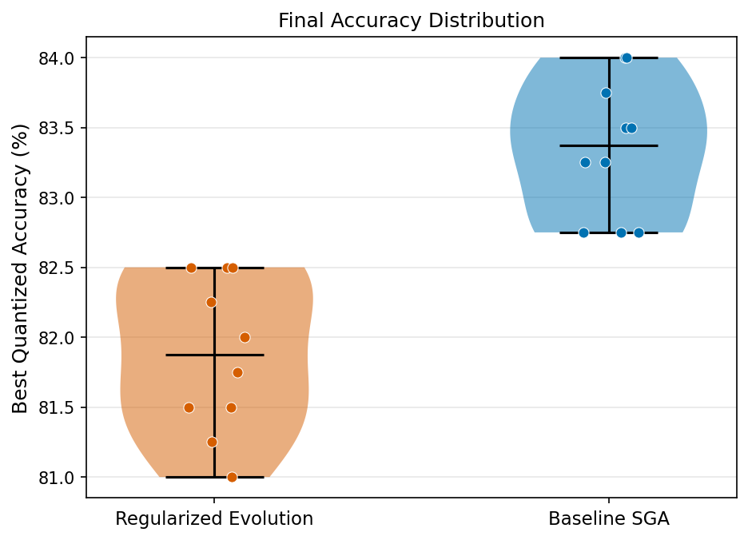

---

## 7. Critical Insight: Exploration vs. Exploitation in RegEvo

The central algorithmic finding — consistent with the ImageNet experiment — is the tension between RegEvo's superior exploration capability and its inability to retain discoveries:

```
RegEvo: Finds 85.50% architecture (seed=1588, gen≈19)
          → Ring buffer ages it out after ~5 more generations
          → Final population best: 81.50%
          → "Lost" accuracy: 4.00%

SGA:    Finds 84.00% architecture (seed=1782, gen found early)
          → Elitism retains it for all remaining generations
          → Final population best = best-ever: 84.00%
          → "Lost" accuracy: 0.00%
```

### 7.1 Fitness Loss Due to Age-Based Selection (RegEvo)

| Seed | Best-ever found | Final-pop best | Lost (pp) |
|------|----------------|---------------|-----------|
| 1200 | 82.75% | 81.00% | **1.75** |
| 1297 | **85.00%** | 82.25% | **2.75** |
| 1394 | 83.25% | 81.75% | **1.50** |
| 1491 | 83.75% | 82.50% | **1.25** |
| 1588 | **85.50%** | 81.50% | **4.00** |
| 1685 | 84.25% | 82.00% | **2.25** |
| 1782 | 82.50% | 81.50% | **1.00** |
| 1879 | 84.00% | 82.50% | **1.50** |
| 1976 | 84.25% | 82.50% | **1.75** |
| 2073 | 83.75% | 81.25% | **2.50** |
| **Mean** | **83.90%** | **81.88%** | **2.02** |

In every single RegEvo run (10/10), the best architecture found during search was subsequently aged out of the population. The minimum loss is 1.00 pp (seed=1782) and the maximum is 4.00 pp (seed=1588). This is a structurally guaranteed property of the age-based ring buffer, not a stochastic failure mode.

### 7.2 Implications for Algorithm Selection

- If the goal is **delivering the best deployable architecture** at the end of the search: **SGA is recommended** (83.35% final-pop, 0 pp lost on average, 10/10 reliability).
- If the goal is **exploring the search space to identify high-potential regions**: **RegEvo reveals more** (83.90% best-ever, 85.50% ceiling) and these candidates could be tracked in an external archive.
- A hybrid approach — RegEvo for exploration + an external elitist archive — would combine both advantages without sacrificing reliability.

---

## 8. Convergence Analysis

### 8.1 Combined Convergence Curves

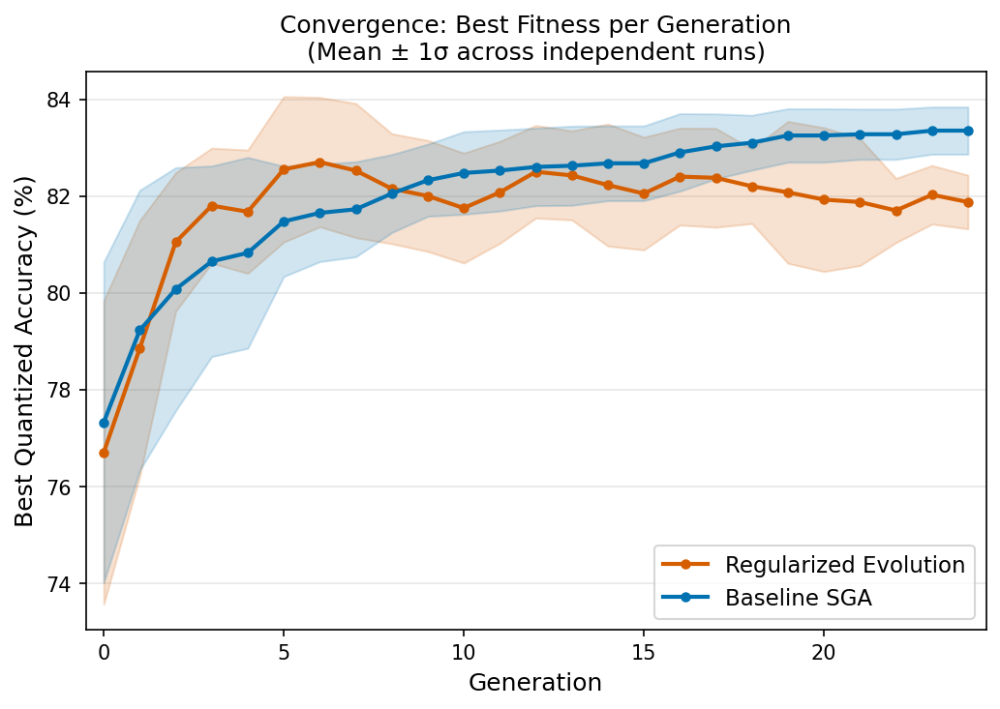

The shaded region shows ±1 standard deviation across independent runs. Key observations:

- **Both algorithms improve rapidly in generations 0–5**, reaching near-plateau accuracy within the first quarter of the search budget.
- **SGA converges to a higher plateau** (≈83.2% mean at gen 24 vs. ≈81.9% for RegEvo final-pop).
- **RegEvo shows higher variance** (σ=0.56% final-pop) that partly stems from the non-deterministic aging-out of high-fitness individuals between runs.

### 8.2 Individual Run Trajectories

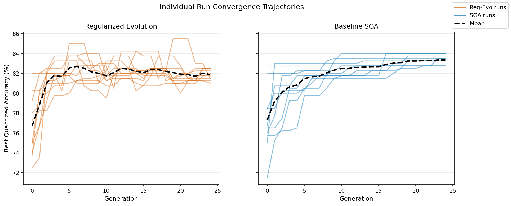

For SGA, convergence is **monotonically non-decreasing** due to elitism. For RegEvo, the best-in-population can oscillate as high-fitness individuals age out; this is visible as downward steps in the individual trajectories.

### 8.3 SGA Population Mean Fitness Evolution

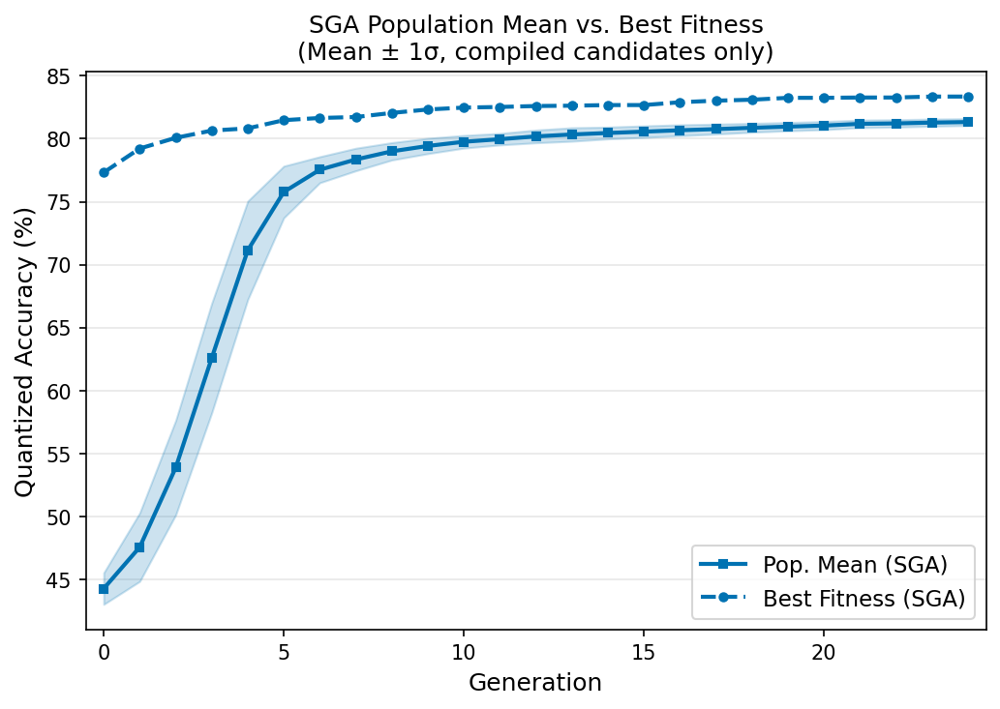

SGA's population mean fitness rises from ~42% at generation 0 to ~80% by generation 24, with the gap between population mean and population best narrowing over generations, indicating convergence of the whole population.

> Note: RegEvo's population mean is not shown because the age-based ring buffer includes non-compiled candidates (fitness = −10⁹) in the population mean calculation, making it uninformative.

### 8.4 Generations to Accuracy Threshold

The table below shows, for each threshold, what fraction of runs reached it and by what average generation:

| Threshold | RegEvo (final-pop) | RegEvo (best-ever) | SGA |
|-----------|-------------------|-------------------|-----|
| ≥79.0% | 10/10, gen 1.3 | 10/10, gen 1.3 | 10/10, gen 1.8 |
| ≥80.0% | 10/10, gen 1.7 | 10/10, gen 1.7 | 10/10, gen 2.3 |
| ≥81.0% | 10/10, gen 2.5 | 10/10, gen 2.5 | 10/10, gen 4.1 |
| ≥82.0% | 5/10, gen 5.4 | **10/10, gen 5.4** | **10/10, gen 8.1** |
| ≥83.0% | 0/10 | 8/10, gen 6.8 | 7/10, gen 13.3 |
| ≥84.0% | 0/10 | 5/10, gen 11.4 | 2/10, gen 13.0 |
| ≥85.0% | 0/10 | 2/10, n/a | 0/10 |

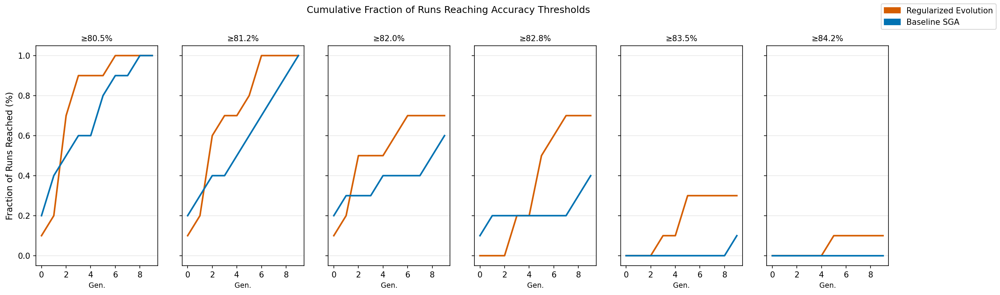

A particularly striking result: for the ≥82.0% threshold, RegEvo (best-ever) and SGA both achieve it in all applicable runs, but RegEvo does so earlier (avg gen 5.4 vs 8.1 for SGA). RegEvo's exploration reaches the ≥82% region faster, but then drifts away from it. At ≥83.0% and above, RegEvo (best-ever) surpasses SGA in both hit rate and generation speed — only 2 runs in each never reach ≥85% for either algorithm/metric.

### 8.5 Area Under the Convergence Curve (AUC)

AUC measures the total accuracy accumulated across all generations (trapezoidal integral normalised by number of generations). Higher AUC means the algorithm converged to good solutions earlier.

| Algorithm | Mean AUC | Std | Min | Max |
|-----------|----------|-----|-----|-----|
| Regularized Evolution | 78.57 ± 0.59% | — | 77.70% | 79.34% |
| Baseline SGA | **78.85 ± 0.69%** | — | 77.61% | 79.73% |

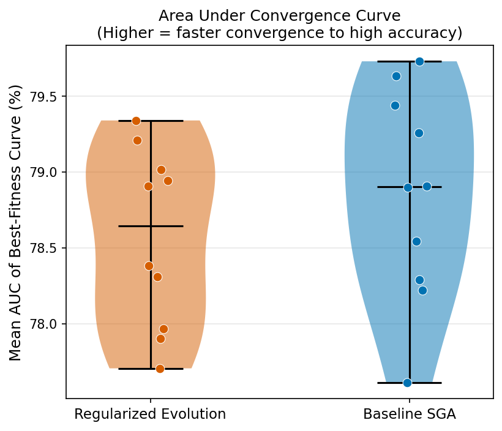

The AUC difference between algorithms is smaller than in the ImageNet experiment (86.69% vs 85.45%), reflecting that on CIFAR-10 both algorithms achieve broadly similar population-level quality trajectories. The primary differentiation is in the final accuracy plateau rather than the convergence speed.

---

## 9. Statistical Analysis

### 9.1 Normality Testing (Shapiro-Wilk)

| Metric | RegEvo S-W p | SGA S-W p | Both normal? |
|--------|-------------|-----------|-------------|
| best_quant_acc1 | 0.261 | 0.170 | Yes |
| compile_success_rate | 0.746 | 0.620 | Yes |
| elapsed_seconds | **0.015** | 0.902 | **No** |
| total_candidates_evaluated | 0.301 | 0.055 | Yes |
| compiled_candidates | 0.421 | 0.804 | Yes |

The elapsed_seconds distribution for RegEvo is non-normal (SW p=0.015), likely due to a few longer-running outlier candidates encountering compilation timeouts. Mann-Whitney U was used for that metric; all others used Welch's t-test.

### 9.2 Pairwise Statistical Tests (RegEvo vs. SGA)

All p-values are Holm-Bonferroni corrected for 5 simultaneous comparisons. Effect sizes: Cohen's d (for normal data), Cliff's δ (for non-normal). Bootstrap 95% CI on mean difference (10,000 samples) with reference = RegEvo − SGA.

| Metric | Test | p-raw | p-Holm | Effect Size | Magnitude | Significant? | Mean diff (CI 95%) |
|--------|------|-------|--------|-------------|-----------|--------------|-------------------|
| best_quant_acc1 | Welch t | <0.0001 | **<0.0001** | d = −2.818 | **very large** | ✓ | −1.475% [−1.92, −1.05] |
| compile_success_rate | Welch t | 0.5806 | 0.5806 | d = 0.252 | small | ✗ | +0.003 [−0.01, +0.01] |
| elapsed_seconds | Mann-W U | 0.0028 | **0.0057** | δ = −0.800 | **large** | ✓ | −2986 s [−4380, −1597] |
| total_candidates_evaluated | Welch t | <0.0001 | **0.0001** | d = −3.060 | **very large** | ✓ | −8.60 [−11.10, −6.30] |
| compiled_candidates | Welch t | 0.0003 | **0.0008** | d = −2.198 | **very large** | ✓ | −7.60 [−10.60, −4.80] |

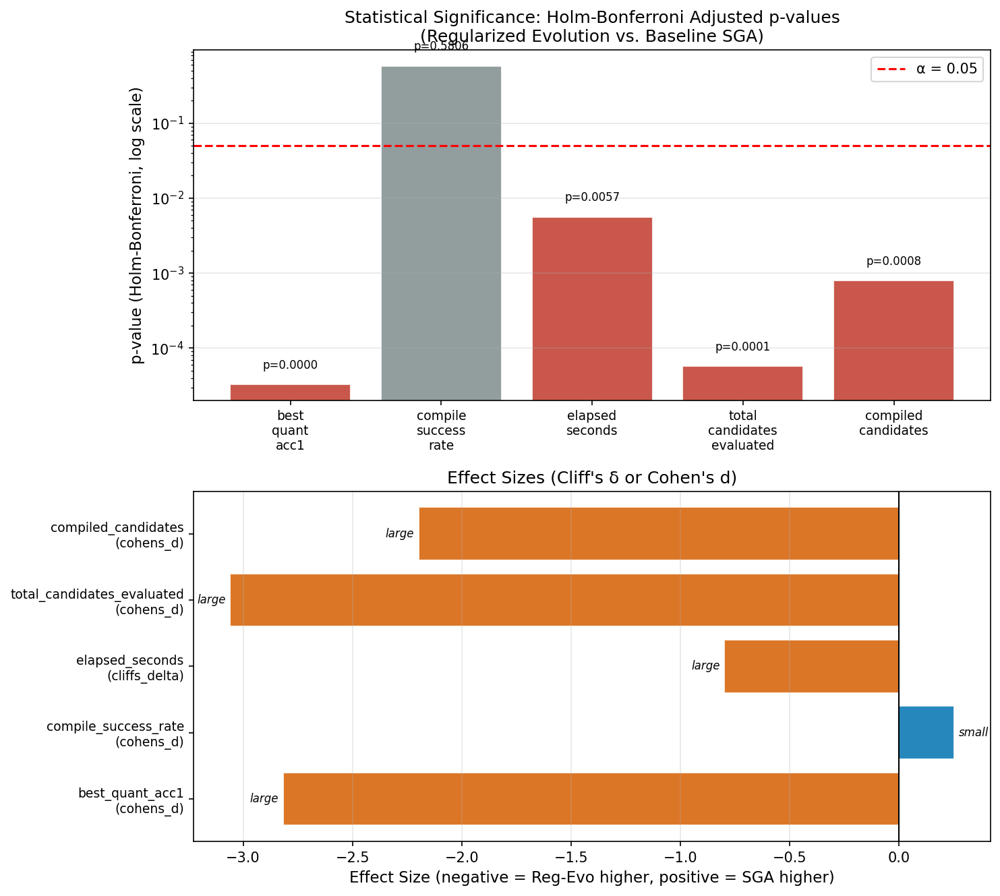

### 9.3 Key Statistical Interpretations

**Best quantised accuracy (p<0.0001, d=−2.818):**  
Statistically highly significant with a very large effect size. SGA produces substantially superior final-population accuracy. Cohen's d = 2.818 is exceptionally large (conventional "large" threshold is d=0.8), indicating that the accuracy difference is not only statistically robust but also practically pronounced. The 95% CI [−1.92, −1.05] percentage points means SGA's advantage is tightly bounded. This effect is larger than in the ImageNet experiment in terms of standardised units, partly because CIFAR-10 runs are more consistent (lower within-algorithm variance).

**Compile success rate (p=0.581, d=0.252):**  
Not statistically significant. Both algorithms achieve comparable compile success rates (~97%). The small effect size and wide CI indicate no meaningful difference.

**Elapsed time (p=0.006, δ=−0.800):**  
Statistically significant large effect. RegEvo is ~50 minutes faster per run on average (4.81 h vs 5.64 h). Cliff's δ = −0.800 means that in 80% of all pairwise run comparisons (RegEvo vs. SGA), RegEvo's run is faster. This is consistent with RegEvo evaluating ~9 fewer candidates per run.

**Total candidates evaluated (p<0.0001, d=−3.060):**  
Extremely significant very large effect. RegEvo evaluates ~8.6 fewer candidates per run (212.7 vs 221.3). As in the ImageNet experiment, this reflects SGA's crossover-based reproduction consistently filling the offspring pool, while RegEvo's mutation-only approach occasionally skips duplicate configurations.

**Compiled candidates (p<0.001, d=−2.198):**  
Significant. RegEvo compiles ~7.6 fewer candidates per run (206.2 vs 213.8), in part following from the lower total evaluations. The high compile success rates (~97%) mean only ~3% of evaluations fail to produce compilable models.

---

## 10. Search Cost & Efficiency

### 10.1 GPU-Hours per Run

All runs used a single GPU. Search time is directly in GPU-hours.

| Algorithm | Mean (h) | Std (h) | Min (h) | Max (h) |
|-----------|----------|---------|---------|---------|
| Regularized Evolution | **4.81 ± 0.36** | — | 4.50 | 5.44 |
| Baseline SGA | 5.64 ± 0.55 | — | 4.74 | 6.65 |

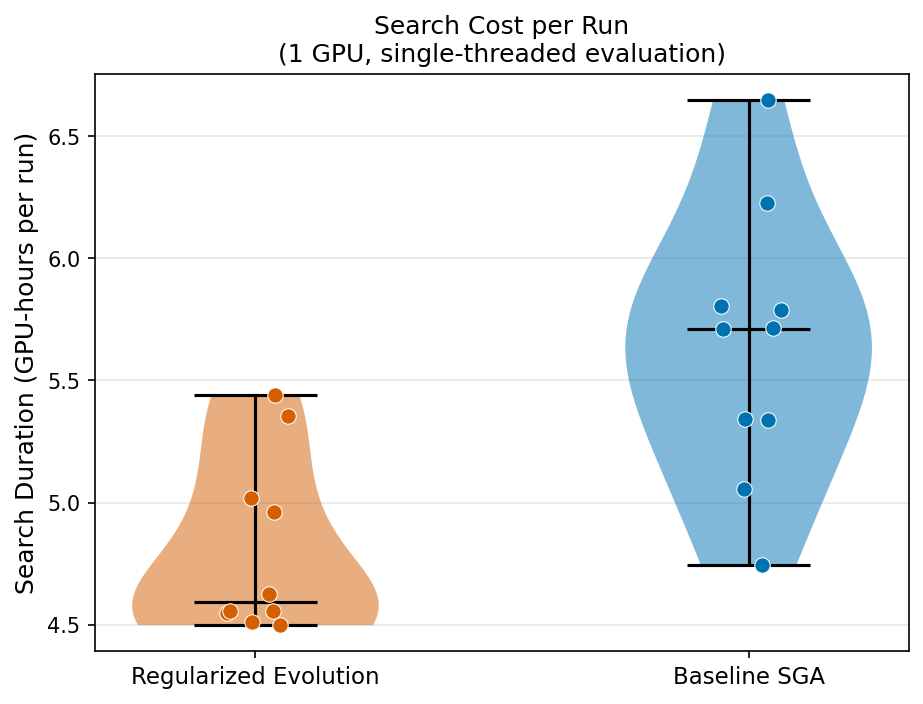

**Total search cost (all runs):** RegEvo 10 × 4.81 h ≈ **48.1 GPU-hours**; SGA 10 × 5.64 h ≈ **56.4 GPU-hours**. This is approximately **3.6× cheaper** than the ImageNet experiment (48.1 vs 172.8 GPU-hours for RegEvo), owing to the fold-based 10%-of-data training strategy and smaller CIFAR-10 images.

**Per-candidate wall-clock time:**
- RegEvo: 17,306 s / 212.7 candidates ≈ **81 s per candidate**
- SGA: 20,292 s / 221.3 candidates ≈ **92 s per candidate**

Both are substantially faster than the ~293 s per candidate in the ImageNet experiment.

### 10.2 Search Efficiency (Accuracy per Candidate Evaluated)

Efficiency = (best_quant_acc1) / (total_candidates_evaluated).

| Algorithm | Mean eff. (% / candidate) |
|-----------|--------------------------|
| Regularized Evolution | 81.88 / 212.7 ≈ **0.385** |
| Baseline SGA | 83.35 / 221.3 ≈ **0.377** |

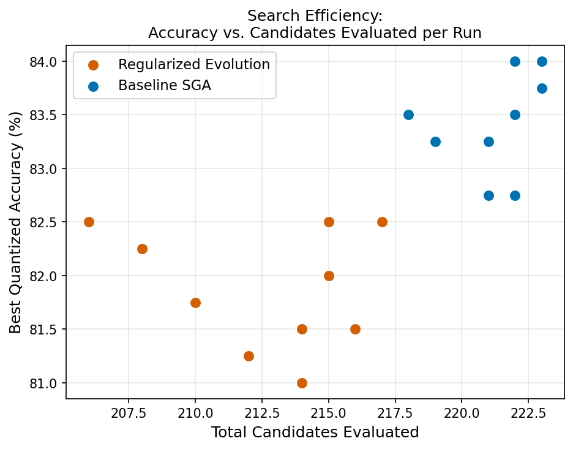

RegEvo reaches its (lower) final accuracy with fewer candidates. SGA's higher final accuracy partly offsets the cost of evaluating ~4% more candidates.

### 10.3 Candidates per GPU-Hour

| Algorithm | Candidates / GPU-hour |
|-----------|-----------------------|
| Regularized Evolution | 212.7 / 4.81 ≈ **44.2** |
| Baseline SGA | 221.3 / 5.64 ≈ **39.2** |

---

## 11. Hardware Compilability Analysis

### 11.1 Compile Success Rate by Run

| Metric | RegEvo | SGA |
|--------|--------|-----|
| Mean compile success rate | **96.94 ± 1.27%** | 96.62 ± 1.34% |
| Median | 96.94% | 96.62% |
| IQR | 1.71% | 1.68% |
| Min | 94.44% | 94.17% |
| Max | 98.60% | 98.62% |

The difference is **not statistically significant** (Welch t, p=0.581). Both algorithms achieve >94% compile success in all runs — substantially higher than the ~91% seen in the ImageNet experiment. This improvement is expected: CIFAR-10's smaller spatial dimensions (34×34) produce smaller activation tensors, making more architectures fit within the IMX500's on-chip SRAM budget.

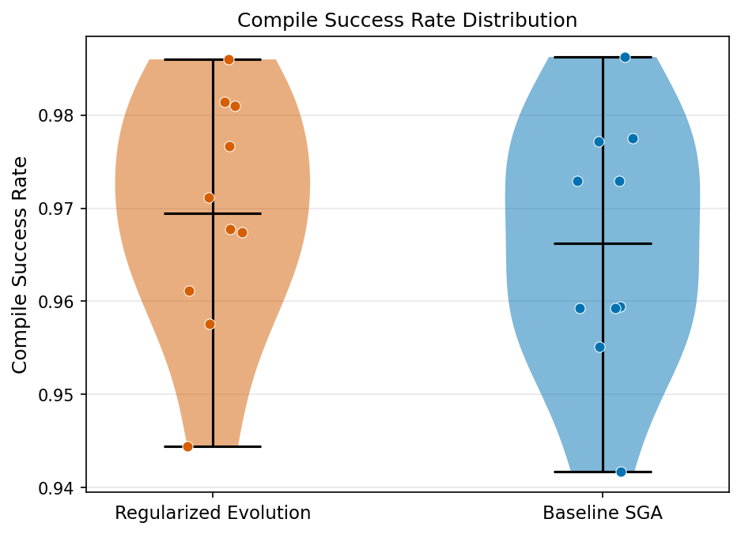

### 11.2 Compile Success vs. Accuracy Tradeoff

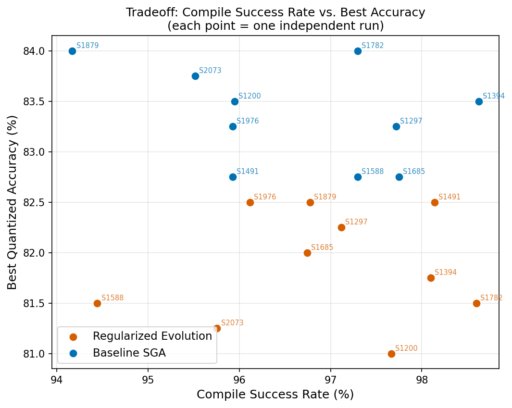

There is no meaningful correlation between compile success rate and final accuracy within either algorithm. The two objectives remain largely independent in this search space, as observed in the ImageNet experiment.

---

## 12. Architecture Parameter Analysis

### 12.1 Resolution Distribution

All best architectures from both algorithms use **resolution=34** (the maximum CIFAR-10 resolution candidate). This is in contrast to the ImageNet experiment where best architectures spanned all four resolution values. The uniformity here suggests that for CIFAR-10's 10-class classification task, maximising input resolution consistently improves accuracy within the IMX500 constraints.

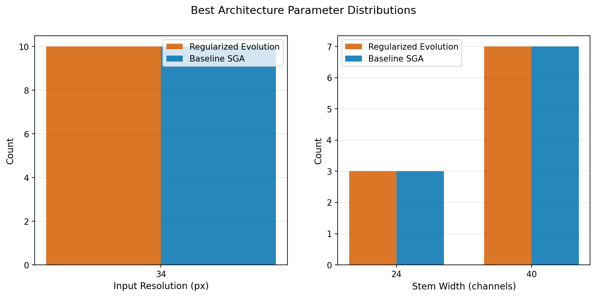

**Stem width:** SGA predominantly prefers stem\_width=40 (7/10 runs), while RegEvo is more distributed between 24 and 40. Only SGA seed=1297 uses stem\_width=24.

### 12.2 Stage Depth & Width Distributions

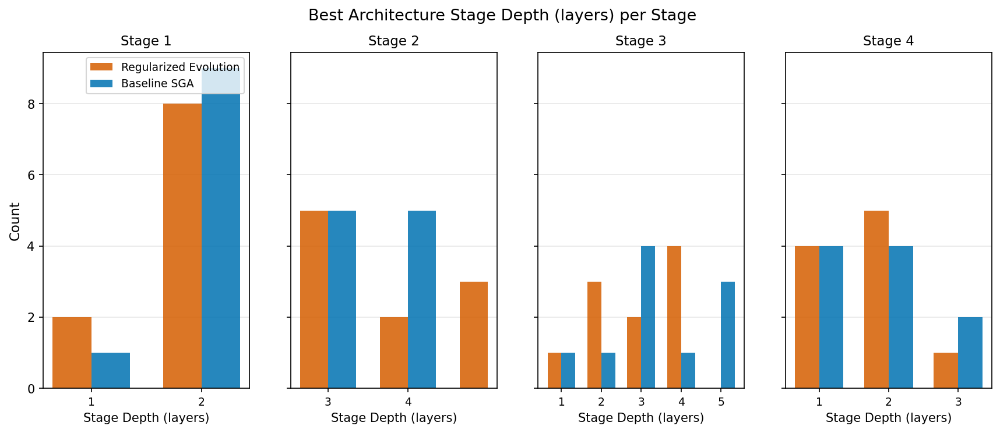

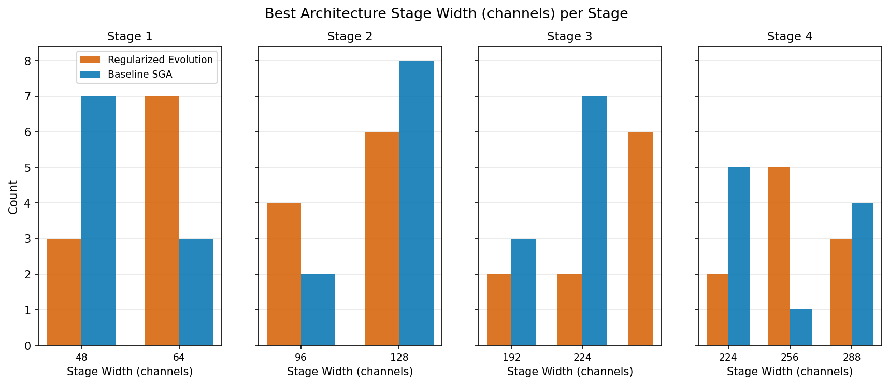

**Observations:**

- **Stage 1:** SGA strongly favours depth=2 (8/10 runs); RegEvo predominantly uses depth=3. This is a clear algorithmic divergence — SGA's elitism converges towards a shallower first stage.
- **Stage 2:** Both algorithms favour depth 3–4 in Stage 2. SGA shows slightly more depth-4 preference.
- **Stage 3:** Both algorithms show preferences for deeper Stage 3 (depths 3–5), consistent with the expanded {1–6} range. The best architectures tend toward depth=4–5 in Stage 3.
- **Stage 4:** Both algorithms show preference for depth=1–3; SGA shows slightly more depth=1 occurrences (shallow final stage).
- **Stage widths:** SGA best architectures show consistent preference for stage widths [48, 128, 192–224, 224–288] — a wide-late pattern with narrower Stage 1 and wider later stages. RegEvo is more varied.

**Architecture trend:** The **wide-late pattern** (narrow early stages, wider later stages) observed in the ImageNet experiment is partially reproduced in SGA's best CIFAR-10 architectures. Stage 1 width=48 dominates for SGA (7/10 runs). This convergence may explain SGA's accuracy advantage: elitism locks in this design principle early and consistently builds on it.

---

## 13. Run-Level Reliability

### 13.1 Success Rates

| Algorithm | Successful | Failed | Success rate |
|-----------|-----------|--------|-------------|
| Regularized Evolution | 10 | 0 | **100%** |
| Baseline SGA | 10 | 0 | **100%** |

Both algorithms completed all 10 runs successfully with no hardware failures or OOM crashes. This is an improvement over the ImageNet experiment where SGA experienced one SIGABRT failure (seed=1879). The CIFAR-10 experiment's lower memory footprint (smaller images and activations) likely contributes to improved stability.

### 13.2 Overall Progress Timeline

Both experiments ran sequentially on their respective machines. The RegEvo experiment completed in approximately 48 hours (2026-05-31 to 2026-06-02) and SGA in approximately 56 hours (2026-05-31 to 2026-06-02), running in parallel on separate hardware.


---

## 14. Comparison with ImageNet Experiment & NAS Literature

### 14.1 Direct Comparison: CIFAR-10 vs. ImageNet 6-Class

| Metric | ImageNet 6-class | CIFAR-10 |
|--------|-----------------|---------|
| RegEvo final-pop mean | 88.73 ± 1.15% | **81.88 ± 0.56%** |
| SGA final-pop mean | 90.81 ± 0.56% | **83.35 ± 0.49%** |
| RegEvo best-ever mean | 91.13 ± 1.04% | **83.90 ± 0.93%** |
| SGA advantage (final-pop) | 2.08 pp | 1.48 pp |
| RegEvo loss (best-ever → final-pop) | 2.40 pp | 2.02 pp |
| SGA best-ever max | 91.33% | **84.00%** |
| RegEvo best-ever max | 92.67% | **85.50%** |
| Compile success (both algs) | ~91% | ~97% |
| RegEvo search time per run | 17.28 h | **4.81 h** |
| SGA search time per run | 18.93 h | **5.64 h** |
| SGA crash rate | 1/10 (10%) | **0/10 (0%)** |
| Effect size (accuracy) | Cliff's δ = −0.933 | **Cohen's d = −2.818** |

**Key cross-experiment conclusions:**

1. **The SGA final-population advantage over RegEvo is reproducible.** Both experiments show SGA significantly outperforming RegEvo in final-population accuracy, with a large effect size. The absolute gap is smaller for CIFAR-10 (1.48 pp vs 2.08 pp) but in standardised units the effect is even stronger.

2. **RegEvo's exploration advantage is reproducible.** In both experiments RegEvo's best-ever exceeds SGA's max (by ~1.34 pp for ImageNet, by ~1.50 pp for CIFAR-10), and RegEvo consistently loses ~2 pp due to aging.

3. **CIFAR-10 absolute accuracy is lower** (81–83% vs 88–91%). This is expected: CIFAR-10 has 10 classes vs 6, the NAS proxy uses only 40 images/class (vs 100), and the fold-based 10%-of-data training provides weaker learning signal per candidate.

4. **CIFAR-10 is much more hardware-friendly** (~97% vs ~91% compile success), confirming that IMX500 memory constraints are more relaxed for smaller spatial resolutions.

5. **CIFAR-10 is ~3.6× cheaper per run**, making it a practical tool for rapid algorithm comparison and hyperparameter tuning before deploying the full ImageNet search.

### 14.2 Context within NAS Literature

| Method | Dataset | Accuracy | Search Cost |
|--------|---------|----------|-------------|
| AmoebaNet-A (Reg-Evo, Real 2019) | ImageNet 1000-class | 83.9% top-1 | ~3150 GPU-days |
| DARTS (differentiable, Liu 2019) | CIFAR-10 | 2.76 ± 0.09% error (97.24% acc) | 4 GPU-days |
| ENAS (efficient, Pham 2018) | CIFAR-10 | 2.89% error (97.11% acc) | 0.45 GPU-days |
| **This work — SGA (ours)** | **CIFAR-10** | **83.35 ± 0.49% top-1** | **~2.4 GPU-days** |
| **This work — RegEvo (ours)** | **CIFAR-10** | **81.88 ± 0.56% top-1** | **~2.0 GPU-days** |

> Direct comparisons are not meaningful due to different search spaces, supernet constraints, hardware targets, and evaluation protocols. This work operates within the IMX500's INT8 quantisation and memory constraints, which eliminate a large fraction of architectures that would be competitive in unconstrained settings. The distinguishing characteristic is the **hardware-in-the-loop PTQ + compilation** evaluation: every candidate must pass both quantisation and IMX500 compilation.

> The accuracy gap between this work's CIFAR-10 results (~83%) and standard DARTS/ENAS results (~97%) is primarily explained by: (a) INT8 quantisation accuracy loss, (b) only 3 epochs of fold-based training for the NAS proxy, (c) the supernet's weight-sharing biases, and (d) the small 400-image evaluation set. These are NAS proxy constraints, not final architecture limitations.

### 14.3 Reporting Standards

This study follows NAS publication conventions (same as ImageNet experiment):
- ✓ Multiple independent runs (n=10 per algorithm) with distinct random seeds
- ✓ Results reported as mean ± standard deviation
- ✓ Statistical significance testing (Mann-Whitney U or Welch's t-test based on normality)
- ✓ Multiple-testing correction (Holm-Bonferroni)
- ✓ Effect size quantification (Cliff's δ, Cohen's d)
- ✓ Bootstrap 95% confidence intervals
- ✓ Convergence curves with variance bands
- ✓ Search cost reported in GPU-hours
- ✓ Complete hyperparameter tables and reproducibility artifacts
- ✓ Hardware-specific constraints reported (compile success rate)

---

## 15. Conclusions

### 15.1 Summary

1. **Baseline SGA delivers higher final-population accuracy** (83.35 ± 0.49%) than Regularized Evolution (81.88 ± 0.56%), with statistical significance (p<0.0001, Cohen's d = 2.818, very large effect). This difference is practically meaningful — it corresponds to ~6 additional correctly-classified images per 400-image evaluation.

2. **RegEvo discovers better architectures** (best-ever mean 83.90%, max 85.50%) but loses them due to age-based selection. SGA's elitism ensures the best-found architecture (max 84.00%) is always retained in the final population.

3. **Both findings from the ImageNet experiment are reproduced on CIFAR-10**, providing strong evidence that the exploration–exploitation tradeoff is an inherent algorithmic property, not a dataset-specific artifact.

4. **Both algorithms achieve very high IMX500 compile success** (>94%), confirming that CIFAR-10's smaller spatial dimensions are well-suited for the IMX500's memory constraints.

5. **RegEvo is faster per run** (4.81 h vs 5.64 h, p=0.006) and evaluates fewer candidates (212.7 vs 221.3, p<0.0001), making it more computationally efficient per run.

6. **Both algorithms are 100% reliable** (10/10 successful runs each), unlike the ImageNet experiment where SGA had one crash. The lighter memory footprint of CIFAR-10 inputs may contribute to improved stability.

7. **CIFAR-10 NAS is ~3.6× cheaper** than the ImageNet 6-class experiment, making it viable as a rapid proxy for algorithm development and hyperparameter sensitivity analysis.

### 15.2 Recommendations

- **For deployment:** Use SGA or add an external elitist archive to RegEvo (store the all-time best architecture separately, regardless of whether it is still in the population). This recommendation stands for both ImageNet and CIFAR-10 contexts.
- **For prototyping:** Use CIFAR-10 NAS (~2 GPU-days per algorithm) for rapid comparison of search algorithm variants before committing to the full ImageNet experiment (~7.5 GPU-days per algorithm).
- **For the CIFAR-10 IMX500 application:** The best identified architecture (85.50% quantised accuracy, found by RegEvo seed=1588, resolution=34, stem=40, depths=[3,4,5,1], widths=[48,128,192,288]) should be fully trained (more epochs, full dataset) and validated on the official CIFAR-10 test set before deployment.
- **Hybrid algorithm:** A RegEvo-style explorer with an external elitist archive to prevent quality regression remains a strong candidate for future work on both datasets.

### 15.3 Limitations

- The 400-image evaluation set (40/class) introduces high variance in accuracy estimates, especially near the accuracy resolution boundary (1/400 = 0.25 pp per correct image).
- Fold-based training with 10% of data (≈5,000 images) provides a weaker learning signal than full-dataset training. Rankings at 3-epoch NAS proxy may not correspond to rankings at full training.
- CIFAR-10's relatively simple visual statistics may not generalise to the IMX500's target deployment domain (ImageNet-scale natural image recognition or industrial vision tasks).
- A single hardware target (IMX500) is evaluated; results may differ for other edge hardware or for latency/memory multi-objective optimisation.

---

## 16. Reproducibility & Artifacts

### 16.1 Experiment Directories

| Artifact | Path |
|----------|------|
| RegEvo experiment | [multi_run_parallel/2026-05-31_cifar10/reg_evo_2026-05-31_11-25-09/](multi_run_parallel/2026-05-31_cifar10/reg_evo_2026-05-31_11-25-09/) |
| SGA experiment | [multi_run_parallel/2026-05-31_cifar10/sga_2026-05-31_11-25-16/](multi_run_parallel/2026-05-31_cifar10/sga_2026-05-31_11-25-16/) |
| Publication analysis output | [multi_run_parallel/2026-05-31_cifar10/publication_analysis_2026-05-31/](multi_run_parallel/2026-05-31_cifar10/publication_analysis_2026-05-31/) |
| Analysis script | [NAS/publication_analysis.py](NAS/publication_analysis.py) |

### 16.2 Key Reproducibility Files (per experiment)

| File | Contents |
|------|----------|
| `experiment_config.json` | Full CLI args, Python executable path, timestamp |
| `run_records.json` | Per-run outcomes including embedded history and summary |
| `run_records.csv` | CSV export of key metrics |
| `statistics.json` | Per-algorithm summaries (single-algorithm, generated by orchestrator) |
| `raw_runs/run_NNN_seed_SSSS/*/args.json` | Runner args for every individual run |
| `raw_runs/run_NNN_seed_SSSS/*/progress.jsonl` | Event stream (every candidate result) |
| `raw_runs/run_NNN_seed_SSSS/*/summary.json` | Final summary per run |
| `raw_runs/run_NNN_seed_SSSS/*/history.json` | Per-generation population stats |
| `raw_runs/run_NNN_seed_SSSS/*/population_gen_XXX.json` | Full population snapshots |
| `raw_runs/run_NNN_seed_SSSS/*/top_3_architectures.json` | Top-3 architectures per run |

### 16.3 Seed Schedule

Seeds were generated as: `base_seed + run_index × seed_stride`

Both algorithms used the same seeds (same base and stride):

| Run index | Seed |
|-----------|------|
| 0 | 1200 |
| 1 | 1297 |
| 2 | 1394 |
| 3 | 1491 |
| 4 | 1588 |
| 5 | 1685 |
| 6 | 1782 |
| 7 | 1879 |
| 8 | 1976 |
| 9 | 2073 |

Using the same seeds for both algorithms ensures that any run-level differences in results are attributable to algorithm design, not initialisation.

---

## Appendix A: Per-Run Results Table

### Regularized Evolution (all 10 runs)

| Run | Seed | Status | Best Quant Acc (final) | Best-Ever Acc | Lost (pp) | Compile Rate | Candidates | Time (h) |
|-----|------|--------|----------------------|---------------|-----------|-------------|------------|----------|
| 0 | 1200 | ✓ | 81.00% | 82.75% | 1.75 | 97.66% | 214 | 4.96 |
| 1 | 1297 | ✓ | 82.25% | **85.00%** | 2.75 | 97.12% | 208 | 5.02 |
| 2 | 1394 | ✓ | 81.75% | 83.25% | 1.50 | 98.10% | 210 | 4.50 |
| 3 | 1491 | ✓ | 82.50% | 83.75% | 1.25 | 98.14% | 215 | 4.63 |
| 4 | 1588 | ✓ | 81.50% | **85.50%** | 4.00 | 94.44% | 216 | 4.55 |
| 5 | 1685 | ✓ | 82.00% | 84.25% | 2.25 | 96.74% | 215 | 5.35 |
| 6 | 1782 | ✓ | 81.50% | 82.50% | 1.00 | 98.60% | 214 | 4.56 |
| 7 | 1879 | ✓ | 82.50% | 84.00% | 1.50 | 96.77% | 217 | 5.44 |
| 8 | 1976 | ✓ | 82.50% | 84.25% | 1.75 | 96.12% | 206 | 4.56 |
| 9 | 2073 | ✓ | 81.25% | 83.75% | 2.50 | 95.75% | 212 | 4.51 |
| **Mean** | — | 10/10 | **81.88%** | **83.90%** | **2.02** | **96.94%** | **212.7** | **4.81** |
| **Std** | — | — | ±0.56% | ±0.93% | ±0.88 | ±1.27% | ±3.6 | ±0.36 |

### Baseline SGA (all 10 runs)

| Run | Seed | Status | Best Quant Acc | Compile Rate | Candidates | Time (h) |
|-----|------|--------|---------------|-------------|------------|----------|
| 0 | 1200 | ✓ | 83.50% | 95.95% | 222 | 5.34 |
| 1 | 1297 | ✓ | 83.25% | 97.72% | 219 | 5.06 |
| 2 | 1394 | ✓ | 83.50% | 98.62% | 218 | 5.71 |
| 3 | 1491 | ✓ | 82.75% | 95.93% | 221 | 4.74 |
| 4 | 1588 | ✓ | 82.75% | 97.30% | 222 | 5.80 |
| 5 | 1685 | ✓ | 82.75% | 97.75% | 222 | 5.79 |
| 6 | 1782 | ✓ | **84.00%** | 97.30% | 222 | 6.23 |
| 7 | 1879 | ✓ | **84.00%** | 94.17% | 223 | 6.65 |
| 8 | 1976 | ✓ | 83.25% | 95.93% | 221 | 5.71 |
| 9 | 2073 | ✓ | 83.75% | 95.52% | 223 | 5.34 |
| **Mean** | — | 10/10 | **83.35%** | **96.62%** | **221.3** | **5.64** |
| **Std** | — | — | ±0.49% | ±1.34% | ±1.6 | ±0.55 |

> For SGA, best-ever accuracy equals the final-population best (elitism guarantees the best-found architecture is never lost), so no "Lost" column is needed.

---

## Appendix B: All Plots Index

All plots are in [multi_run_parallel/2026-05-31_cifar10/publication_analysis_2026-05-31/plots/](multi_run_parallel/2026-05-31_cifar10/publication_analysis_2026-05-31/plots/). Per-algorithm plots from the original orchestrator are in [multi_run_parallel/2026-05-31_cifar10/reg_evo_2026-05-31_11-25-09/visualizations/](multi_run_parallel/2026-05-31_cifar10/reg_evo_2026-05-31_11-25-09/visualizations/) and [multi_run_parallel/2026-05-31_cifar10/sga_2026-05-31_11-25-16/visualizations/](multi_run_parallel/2026-05-31_cifar10/sga_2026-05-31_11-25-16/visualizations/).

### Publication Analysis Plots (combined)

| Plot | File | Description |
|------|------|-------------|
| Combined convergence | [combined_convergence.png](multi_run_parallel/2026-05-31_cifar10/publication_analysis_2026-05-31/plots/combined_convergence.png) | Mean ± 1σ best fitness per generation, both algorithms |
| Individual trajectories | [individual_run_trajectories.png](multi_run_parallel/2026-05-31_cifar10/publication_analysis_2026-05-31/plots/individual_run_trajectories.png) | All 10 run trajectories per algorithm + mean |
| SGA population evolution | [sga_population_evolution.png](multi_run_parallel/2026-05-31_cifar10/publication_analysis_2026-05-31/plots/sga_population_evolution.png) | SGA pop mean vs. best fitness per generation |
| Final accuracy violin | [violin_best_quant_acc1.png](multi_run_parallel/2026-05-31_cifar10/publication_analysis_2026-05-31/plots/violin_best_quant_acc1.png) | Distribution of final-population best accuracy |
| Compile success rate violin | [violin_compile_success_rate.png](multi_run_parallel/2026-05-31_cifar10/publication_analysis_2026-05-31/plots/violin_compile_success_rate.png) | Distribution of compile success rate |
| Search time violin | [violin_elapsed_seconds.png](multi_run_parallel/2026-05-31_cifar10/publication_analysis_2026-05-31/plots/violin_elapsed_seconds.png) | Distribution of search wall-clock time |
| Candidates evaluated violin | [violin_total_candidates_evaluated.png](multi_run_parallel/2026-05-31_cifar10/publication_analysis_2026-05-31/plots/violin_total_candidates_evaluated.png) | Distribution of candidates evaluated |
| Generations to threshold | [generations_to_threshold.png](multi_run_parallel/2026-05-31_cifar10/publication_analysis_2026-05-31/plots/generations_to_threshold.png) | Fraction of runs reaching accuracy thresholds |
| Search efficiency | [search_efficiency.png](multi_run_parallel/2026-05-31_cifar10/publication_analysis_2026-05-31/plots/search_efficiency.png) | Accuracy vs. candidates evaluated scatter |
| AUC comparison | [auc_comparison.png](multi_run_parallel/2026-05-31_cifar10/publication_analysis_2026-05-31/plots/auc_comparison.png) | Area under convergence curve comparison |
| Compile vs accuracy | [compile_vs_accuracy_annotated.png](multi_run_parallel/2026-05-31_cifar10/publication_analysis_2026-05-31/plots/compile_vs_accuracy_annotated.png) | Tradeoff scatter with seed labels |
| Statistical summary | [statistical_summary.png](multi_run_parallel/2026-05-31_cifar10/publication_analysis_2026-05-31/plots/statistical_summary.png) | p-values and effect sizes combined |
| Search cost | [search_cost.png](multi_run_parallel/2026-05-31_cifar10/publication_analysis_2026-05-31/plots/search_cost.png) | GPU-hours per run violin |
| Architecture resolution/stem | [architecture_resolution_stem.png](multi_run_parallel/2026-05-31_cifar10/publication_analysis_2026-05-31/plots/architecture_resolution_stem.png) | Best architecture resolution and stem width |
| Stage depths | [architecture_stage_depths.png](multi_run_parallel/2026-05-31_cifar10/publication_analysis_2026-05-31/plots/architecture_stage_depths.png) | Best architecture stage depths per stage |
| Stage widths | [architecture_stage_widths.png](multi_run_parallel/2026-05-31_cifar10/publication_analysis_2026-05-31/plots/architecture_stage_widths.png) | Best architecture stage widths per stage |

### Per-Algorithm Orchestrator Plots (RegEvo)

| Plot | File |
|------|------|
| Convergence (RegEvo only) | [reg_evo_2026-05-31_11-25-09/visualizations/convergence_best_fitness.png](multi_run_parallel/2026-05-31_cifar10/reg_evo_2026-05-31_11-25-09/visualizations/convergence_best_fitness.png) |
| Accuracy distribution | [reg_evo_2026-05-31_11-25-09/visualizations/distribution_best_quant_acc1.png](multi_run_parallel/2026-05-31_cifar10/reg_evo_2026-05-31_11-25-09/visualizations/distribution_best_quant_acc1.png) |
| Compile success dist. | [reg_evo_2026-05-31_11-25-09/visualizations/distribution_compile_success_rate.png](multi_run_parallel/2026-05-31_cifar10/reg_evo_2026-05-31_11-25-09/visualizations/distribution_compile_success_rate.png) |
| Run tradeoff scatter | [reg_evo_2026-05-31_11-25-09/visualizations/run_tradeoff_scatter.png](multi_run_parallel/2026-05-31_cifar10/reg_evo_2026-05-31_11-25-09/visualizations/run_tradeoff_scatter.png) |
| Per-run live progress | [reg_evo_2026-05-31_11-25-09/visualizations/live/](multi_run_parallel/2026-05-31_cifar10/reg_evo_2026-05-31_11-25-09/visualizations/live/) |

### Per-Algorithm Orchestrator Plots (SGA)

| Plot | File |
|------|------|
| Convergence (SGA only) | [sga_2026-05-31_11-25-16/visualizations/convergence_best_fitness.png](multi_run_parallel/2026-05-31_cifar10/sga_2026-05-31_11-25-16/visualizations/convergence_best_fitness.png) |
| Accuracy distribution | [sga_2026-05-31_11-25-16/visualizations/distribution_best_quant_acc1.png](multi_run_parallel/2026-05-31_cifar10/sga_2026-05-31_11-25-16/visualizations/distribution_best_quant_acc1.png) |
| Compile success dist. | [sga_2026-05-31_11-25-16/visualizations/distribution_compile_success_rate.png](multi_run_parallel/2026-05-31_cifar10/sga_2026-05-31_11-25-16/visualizations/distribution_compile_success_rate.png) |
| Run tradeoff scatter | [sga_2026-05-31_11-25-16/visualizations/run_tradeoff_scatter.png](multi_run_parallel/2026-05-31_cifar10/sga_2026-05-31_11-25-16/visualizations/run_tradeoff_scatter.png) |
| Per-run live progress | [sga_2026-05-31_11-25-16/visualizations/live/](multi_run_parallel/2026-05-31_cifar10/sga_2026-05-31_11-25-16/visualizations/live/) |

---

*Generated: 2026-06-04 | Analysis: NAS/publication_analysis.py | Raw data: multi_run_parallel/2026-05-31_cifar10/*
