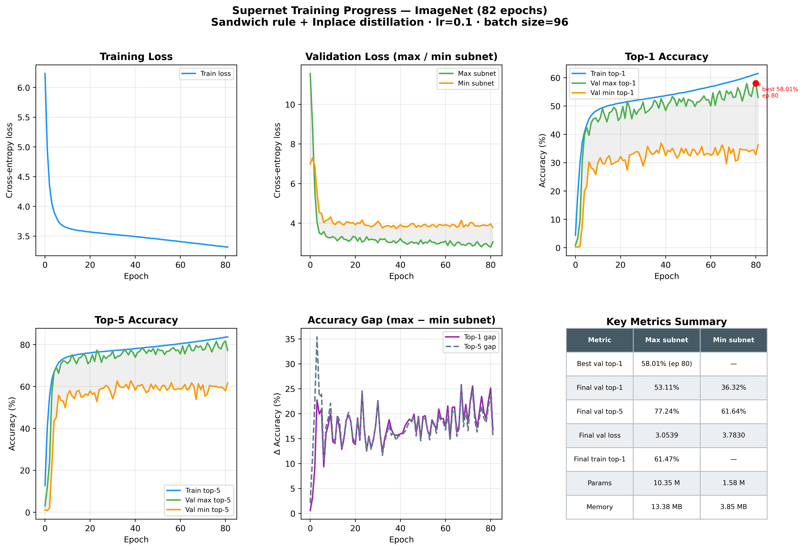

# Supernet Training Results

## Overview

| Field | Value |
|---|---|
| Dataset | ImageNet-1k (1,131,492 train / 199,675 val samples, 15% val split) |
| Epochs completed | **82 / 120** (stopped at epoch 81 — per-epoch improvement was too small to justify continuing before the next experiment) |
| Training start | 2026-04-02 20:03:01 |
| Training end | 2026-04-11 17:29:54 |
| **Total training time** | **≈ 8 days 21 h 27 min (~213.5 h)** |
| Avg. time per epoch | ≈ 2 h 36 min (train ~1 h 57 min + 2× val ~22–24 min each) |

---

## Hardware

| Field | Value |
|---|---|
| GPU | NVIDIA RTX A5000 (24 GB VRAM) |
| GPU count | 1 (single-GPU) |
| Device | CUDA |

---

## Training Configuration

| Hyperparameter | Value |
|---|---|
| Batch size | 96 |
| Learning rate | 0.1 (cosine decay) |
| Momentum | 0.9 |
| Weight decay | 5 × 10⁻⁵ |
| Gradient clip | 1.0 |
| Label smoothing | 0.1 |
| Warmup epochs | 5 |
| Mixed precision (AMP) | ✓ |
| Sandwich rule | ✓ |
| Inplace distillation | ✓ |
| Architectures per step | 3 |
| Data workers | 8 |
| Random seed | 42 |
| Target memory budget | 8,388,480 bytes (~8.0 MB) |
| Target tolerance ratio | 0.25 |

---

## Supernet Architecture Profile

### Search Space

| Dimension | Candidates |
|---|---|
| Input resolution | 192, 224, 256 |
| Stem width | 24, 32, 40 |
| Stage 1 depth | 1, 2, 3 |
| Stage 2 depth | 1, 2, 3, 4 |
| Stage 3 depth | 1, 2, 3, 4, 5 |
| Stage 4 depth | 1, 2, 3 |
| Stage 1 width | 48, 64 |
| Stage 2 width | 96, 128 |
| Stage 3 width | 160, 192, 224 |
| Stage 4 width | 224, 256, 288 |

### Boundary Subnets

| Subnet | Resolution | Stem | Stage depths | Stage widths | Params | Total memory |
|---|---|---|---|---|---|---|
| **Max** | 256 | 40 | [3, 4, 5, 3] | [64, 128, 224, 288] | 10.35 M | 13.38 MB |
| **Min** | 192 | 24 | [1, 1, 1, 1] | [48, 96, 160, 224] | 1.58 M | 3.85 MB |

The target of 8.0 MB sits between the two extremes, enabling NAS to find subnets that fit the hardware memory constraint.

---

## Results

### Best Checkpoints

| Epoch | Val top-1 (max subnet) |
|---|---|
| 3 | 30.27% |
| 5 | 42.48% |
| 12 | 49.11% |
| 23 | 51.68% |
| 43 | 53.37% |
| 61 | 54.67% |
| 64 | 55.35% |
| 67 | 55.42% |
| 72 | 56.52% |
| 76 | 57.92% |
| **80** | **58.01%** ← best |

### Final Metrics (epoch 81)

| Metric | Max subnet | Min subnet |
|---|---|---|
| Val top-1 | 53.11% | 36.32% |
| Val top-5 | 77.24% | 61.64% |
| Val loss | 3.054 | 3.783 |
| Train top-1 | 61.47% | — |
| Train top-5 | 83.63% | — |
| Train loss | 3.315 | — |

**Best val top-1 (max subnet): 58.01% at epoch 80**

---

## Training Progress

The plot shows six panels:
- **Training loss** — steady decrease throughout.
- **Validation loss** — max and min subnet, with shaded gap between them.
- **Top-1 accuracy** — train and both boundary subnets; red dot marks the best checkpoint.
- **Top-5 accuracy** — same breakdown.
- **Accuracy gap (max − min)** — starts above 25 pp, converges to ~17 pp by epoch 81.
- **Key metrics summary table** — final and best numbers at a glance.

### Observations

- Training loss decreased smoothly from 6.24 → 3.31, indicating stable convergence with the sandwich rule and inplace distillation.
- Max subnet val top-1 improved sharply in the first 5 epochs (0.9% → 42.5%), then settled into slow but consistent gains.
- Min subnet top-1 lagged significantly initially but reached 36.3% by epoch 81, benefiting from the inplace distillation from the max subnet.
- The accuracy gap (max − min, top-1) narrowed from ~28 pp at epoch 4 to ~17 pp at epoch 81, consistent with progressive knowledge transfer.
- Per-epoch improvement in the final 20 epochs was ≲ 0.15 pp for the max subnet, motivating the decision to stop and proceed to the next experiment.
- Training was stopped at epoch 81 of 120; with full training the max subnet would likely have reached ≈ 60–62% val top-1 based on the trajectory.
